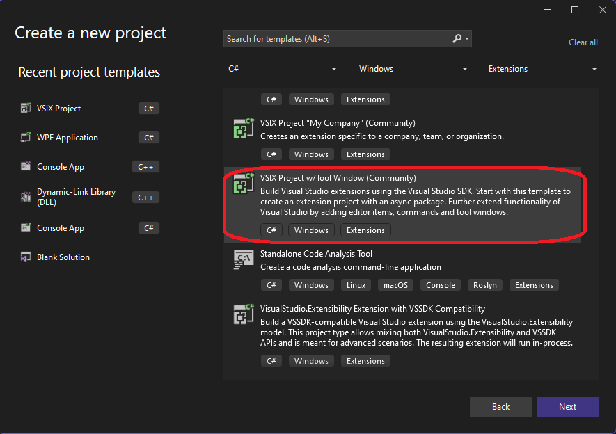

# Dependency Injection(DI) using Autofac

## Todo WIP

## Objective
1. This example introduces Dependency Injection configuration for VSix package project.
2. We are using Autofac as the container.
3. This also uses CommunityToolKit for Mvvm.

## How this project is built.
1. Starting Again

2. Add Autofac 
3. 