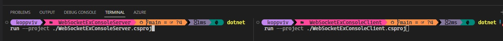

# Introducing WebSockets.

# References
1. https://zetcode.com/csharp/websocket/
2. https://www.tabsoverspaces.com/233883-simple-websocket-client-and-server-application-using-dotnet
3. https://developer.mozilla.org/en-US/docs/Web/API/WebSockets_API/Writing_WebSocket_server
4. https://medium.com/bina-nusantara-it-division/implementing-websocket-client-and-server-on-asp-net-core-6-0-c-4fbda11dbceb
5. https://www.wallarm.com/what/a-simple-explanation-of-what-a-websocket-is
6. https://medium.com/nerd-for-tech/your-first-c-websocket-client-5e7acc30681d
7. https://thecodegarden.net/websocket-client-dotnet
8. https://stackoverflow.com/a/64729533/1977871

# How the example is created.
1. This is based on the following
2. https://developer.mozilla.org/en-US/docs/Web/API/WebSockets_API/Writing_WebSocket_server#wsserver.cs
3. And the [clinet in this example here](https://www.tabsoverspaces.com/233883-simple-websocket-client-and-server-application-using-dotnet).
4. At the server, TcpListener is used.

# How to run the example.
1. Open two terminals and get into the server project folder and client project folder.
2. First run the server projcet. Let the server be ready.
3. Then run the client. 

4. Messages go from client to server. 
5. Handshake is successifull. 
6. Once the handshake is successifull, a message from client is sent. And that is recieved at the server.
7. But the message that is sent from the server to the client is not recieved. An exception occurs.
8. Not able to resolve this one. Not sure, how to handle this. 