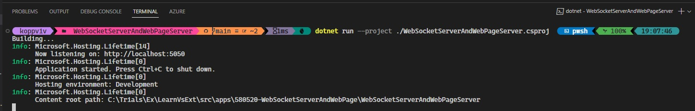
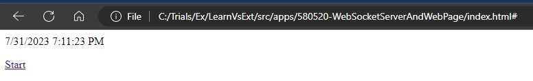

# References
1. https://zetcode.com/csharp/websocket/

# How this example is created.
1. The server and with index.html web page.

# How to run. 
1. Run the server and then open the index.html web page in a chrome or Edge.
2. Click the start link of the page.
   

4. Here is the page.

