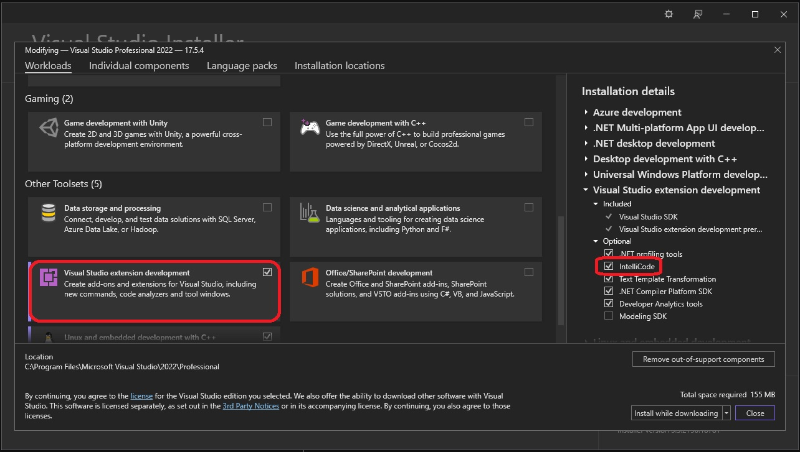
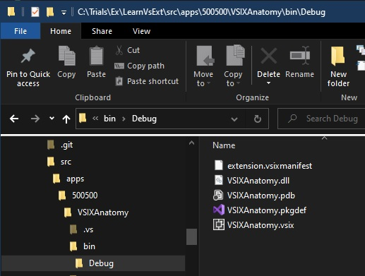
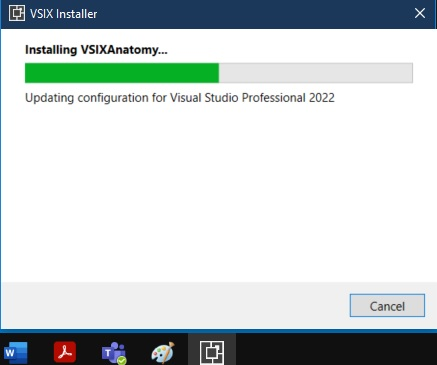
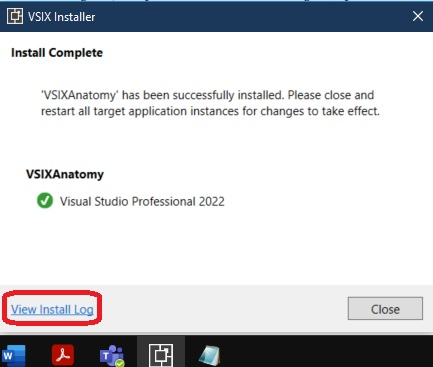
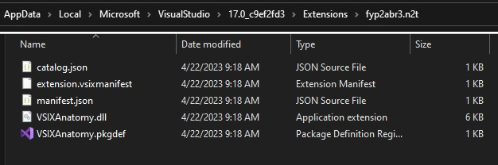
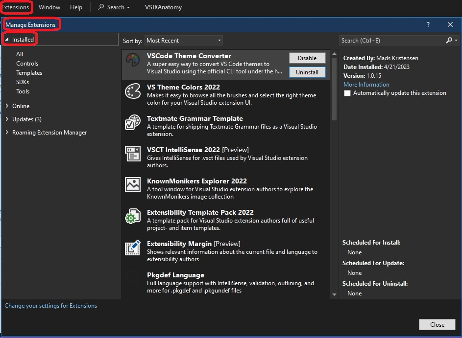

## Pre Requisites
1. The Visual Studio Extensibility Workload

2. The second one is a community driven extension called 
[Extensibility Essentials for Vs 2022](https://marketplace.visualstudio.com/items?itemName=MadsKristensen.ExtensibilityEssentials2022)

# New Project creation

1. Create a new project as follows.

2. Then build and observe the output.

3. Install the extension as follows.

4. See the logs.

5. Once installed, open the logs. You will see something like

> The extension has been installed to C:\Users\koppviv\AppData\Local\Microsoft\VisualStudio\17.0_c9ef2fd3\Extensions\fyp2abr3.n2t\

6. Go to that path and you will see

7. To uninstall 
   1. Visual Studio 2019: Extensions > Manage Extensions
   2. Visual Studio 2022: Extensions > Manage Extensions
   3. Then Go to the installed section and do the uninstall.
   

8. Take a look at the following as well
   1. https://stackoverflow.com/a/32672070/1977871

9. Finally after you uninstall, do take a look at the path C:\Users\koppviv\AppData\Local\Microsoft\VisualStudio\17.0_c9ef2fd3\Extensions\fyp2abr3.n2t\

That should be gone now, after the uninstall.

10. Here we go...