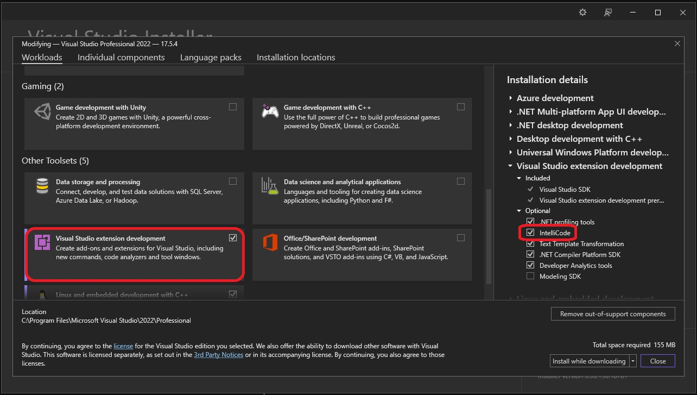
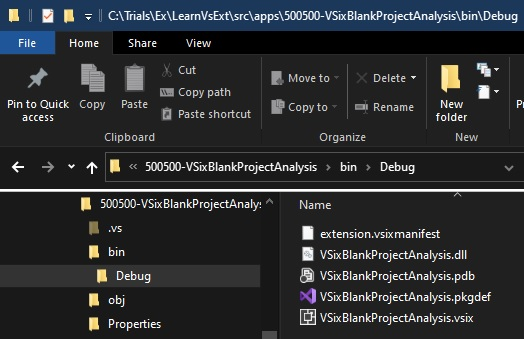
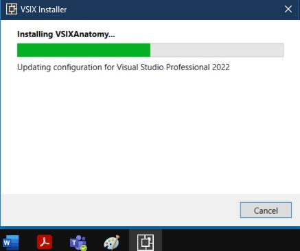
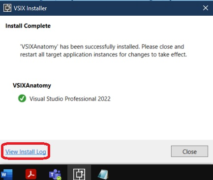
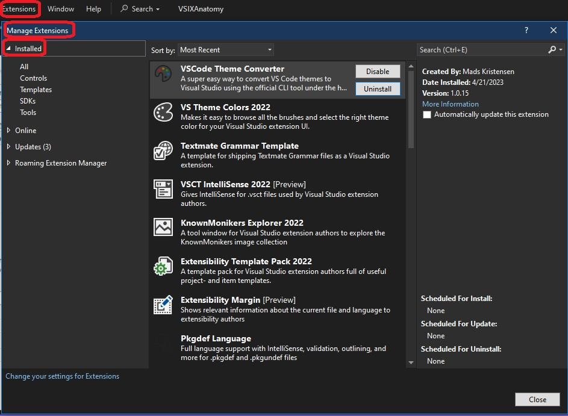

## Pre Requisites
1. The Visual Studio Extensibility Workload

2. The second one is a community driven extension called 
[Extensibility Essentials for Vs 2022](https://marketplace.visualstudio.com/items?itemName=MadsKristensen.ExtensibilityEssentials2022)

# New Project creation

1. Create a new project as follows.

2. Then build and observe the output.

3. Install the extension as follows.

4. See the logs.

5. Once installed, open the logs. You will see something like

> The extension has been installed to C:\Users\YourUserName\AppData\Local\Microsoft\VisualStudio\17.0_c9ef2fd3\Extensions\fyp2abr3.n2t\

   The first part is specific to the logged-in user and varies from machine to machine.
   This path is the local Appdata folder of the user and can be accessed directly by the
   environment variable %LOCALAPPDATA%.

   The second part is the relative part where the extensions are installed. The path
   comprises the folder structure, starting with Microsoft, which contains a folder named
   VisualStudio followed by the version of Visual Studio, which would vary for Visual
   Studio versions.

   The third and final part is a folder name that the VSIX installer generates for the
   extension to keep it unique

6. Go to that path and you will see

7. To uninstall 
   1. Visual Studio 2019: Extensions > Manage Extensions
   2. Visual Studio 2022: Extensions > Manage Extensions
   3. Then Go to the installed section and do the uninstall.
   

8. Take a look at the following as well
   1. https://stackoverflow.com/a/32672070/1977871
   2. https://stackoverflow.com/a/76146656/1977871

9. You may also want to run the following command to uninstall the extensions from Visual studio experimental or reset the extensions from Visual Studio Experimental 

1.  Finally after you uninstall, do take a look at the path C:\Users\koppviv\AppData\Local\Microsoft\VisualStudio\17.0_c9ef2fd3\Extensions\fyp2abr3.n2t\

That should be gone now, after the uninstall.

11. Note the [Microsoft.VisualStudio.SDK](https://www.nuget.org/packages/microsoft.visualstudio.sdk) nuget package reference. This package is a meta package and contains the Visual Studio Software Development Kit (SDK). When you installed this NuGet package in a stand-alone project, it will bring down 150+ assemblies!!!

