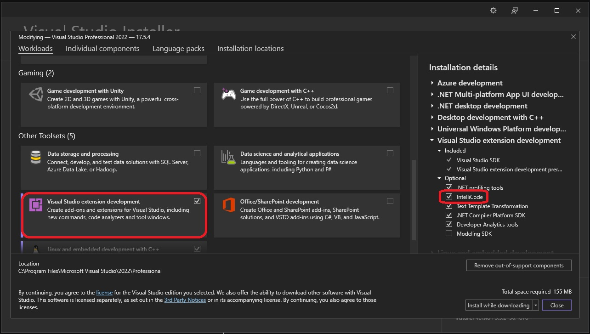
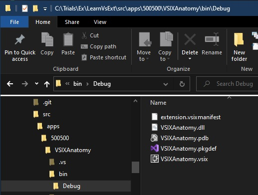

## Pre Requisites
1. The Visual Studio Extensibility Workload

2. The second one is a community driven extension called 
[Extensibility Essentials for Vs 2022](https://marketplace.visualstudio.com/items?itemName=MadsKristensen.ExtensibilityEssentials2022)

# New Project creation

1. Create a new project as follows.

2. Then build and observe the output.

3. 