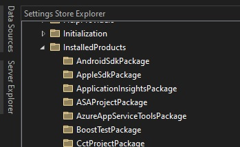

1. This example is similar to the 500650-AddingSimpleCommand. 

2. The project is created exactly same way.

3. This is based on the article [**Using the Settings Store**](https://learn.microsoft.com/en-us/visualstudio/extensibility/using-the-settings-store?view=vs-2022)

4. Visual Studio Setting store is where Visual Studio, during and after installation, stores many of its settings. There is an excellent tool to visualize this. This tool comes in the form of [an extension and can be installed from here](https://marketplace.visualstudio.com/items?itemName=PaulHarrington.SettingsStoreExplorerPreview).


5. Look at installed Products.



6. Are the phone tools installed on your machine?

```cs
var settingsManager = new ShellSettingsManager(this.package);
var configurationSettingsStore = settingsManager.GetReadOnlySettingsStore(SettingsScope.Configuration);
var arePhoneToolsInstalled = configurationSettingsStore.CollectionExists(@"InstalledProducts\Microsoft Windows Phone Developer Tools");
```

7. 
