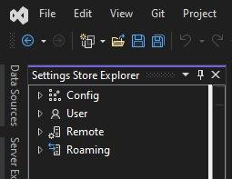
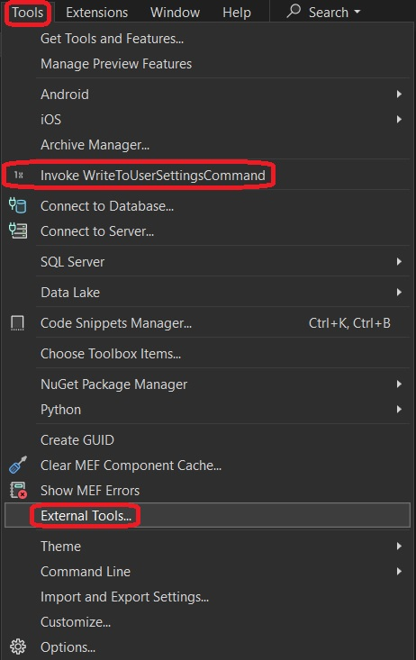

1. This example is similar to the 500650-AddingSimpleCommand. 

2. The project is created exactly same way.

3. This is based on the article [**Writing to the User Settings Store**](https://learn.microsoft.com/en-us/visualstudio/extensibility/writing-to-the-user-settings-store?view=vs-2022)

4. Visual Studio Setting store is where Visual Studio, during and after installation, stores many of its settings. There is an excellent tool to visualize this. This tool comes in the form of [an extension and can be installed from here](https://marketplace.visualstudio.com/items?itemName=PaulHarrington.SettingsStoreExplorerPreview).

5. Build and Run the project. Look at Tools menu.

6. External Tools

7. Now click the new command Tools -> Invoke WriteToUserSettingsCOmmand. Now observe again. 

8. External Tools After

