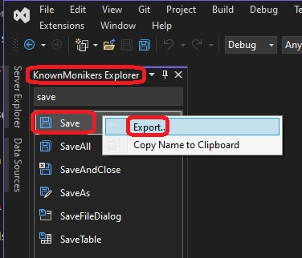

1. Demos how to use existing visual studio moniker icons for the extension.

2. First of all, Visual Studio shipps with thousands of icons.

3. Open Visual Studio without code. Feature Search(Ctrl + Q) for known monikers. You will see a Known Moniker Explorer Window.

4. You ccan now search for icons. There are many readly available.

5. Now you can select one, and you can even export, it as png, jpg or gif to any location on the disc.

6. Now to use an existing icon from the known moniker in the VSIX package, do the following. 

7. Lets create a new VSIX package.

8. Add a command.  