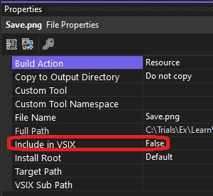

## Introducing Image Manifest Tools Extension

1. Create a new VSIX package. Then add a new folder images. 

2. Then add a png to the images folder. Look at the earlier example(500725-ImageManifestToolsExten). 
   1. See the steps how to add a png file. See the following step.
   2. From the known monikers you can select one, and you can even export, it as png, jpg or gif to any location on the disc 

3. Include the added png file into the project. Then from the image properties, set include in VSIX to be true.

4. Ensure [Image Manifest Tools](https://marketplace.visualstudio.com/items?itemName=MadsKristensen.ImageManifestTools) is installed. Also see https://github.com/madskristensen/MonikerManifestTools

5. This should be part of [Extensibility Essentials pack](https://marketplace.visualstudio.com/items?itemName=MadsKristensen.ExtensibilityEssentials2022).

6. Right click and take a look at the properties of the sav.png file. Irrespecitve of weather Include in VSIX is true or false, you can create a imagemanifest file. And the image manifest file will be identical irrespecitve of weather Include in VSIX is true or false.
   
   

7. 