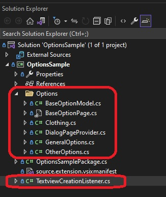
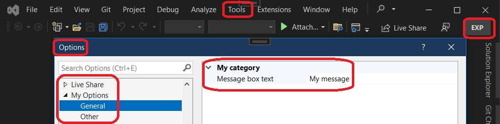
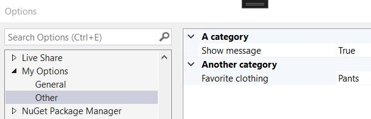

# Options Sample.
1. This is an enhanced options sample. A bit more exotic.
2. Introduces **IWpfTextViewCreationListener**

```cs
public interface IWpfTextViewCreationListener
{
    void TextViewCreated(IWpfTextView textView);
}
```

3. The method in the interface **TextViewCreated** is executed when you open any file in the editor window


## Reference: 
1. https://github.com/microsoft/VSSDK-Extensibility-Samples/tree/master/Options
2. https://learn.microsoft.com/en-us/dotnet/api/microsoft.visualstudio.text.editor.iwpftextview
3. https://learn.microsoft.com/en-us/visualstudio/extensibility/inside-the-editor


## Futher reading
Read the docs for all the details surrounding these scenarios, but notice that while they do provide more detailed documentation, they don't follow the best practices outlined in this sample.

* [Creating an Options Page](https://docs.microsoft.com/en-us/visualstudio/extensibility/creating-an-options-page)
* [Using the Settings Store](https://docs.microsoft.com/en-us/visualstudio/extensibility/using-the-settings-store)
* [Writing to the User Settings Store](https://docs.microsoft.com/en-us/visualstudio/extensibility/writing-to-the-user-settings-store)

## How this project is created. 
1. Create a VSix project.

2. Added reference System.ComponentModel.Composition.

3. Added necessary references, such as presentation core etc.


4. References, and adds an asset node of type MefComponent in the vsixmanifest, etc


5. The above two steps can be accomplished by adding a EditorClassifier new item and then deleting it.

6. Now add the following classes. These you can pick from the reference.


7. My Options General



8. My Options Other



