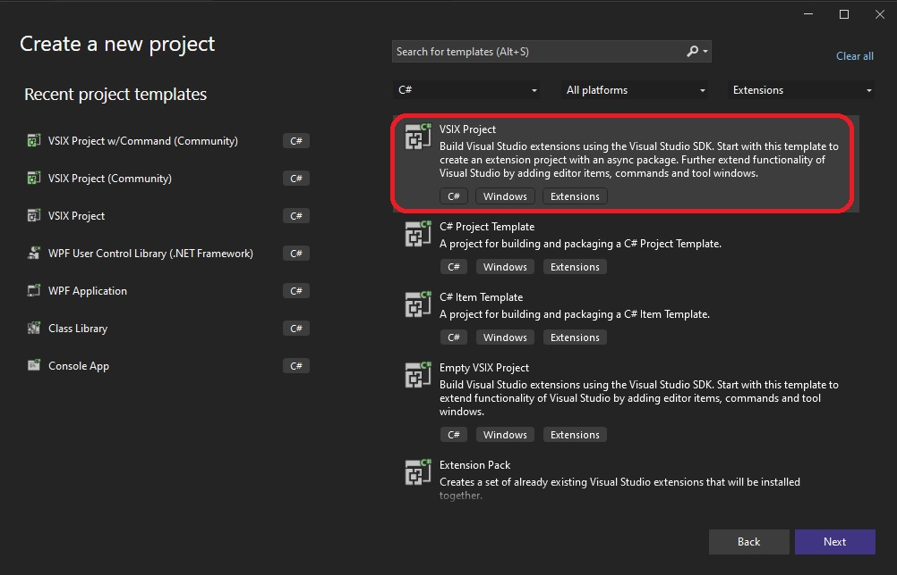
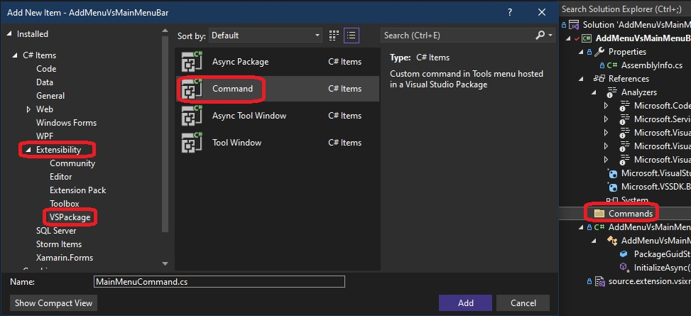
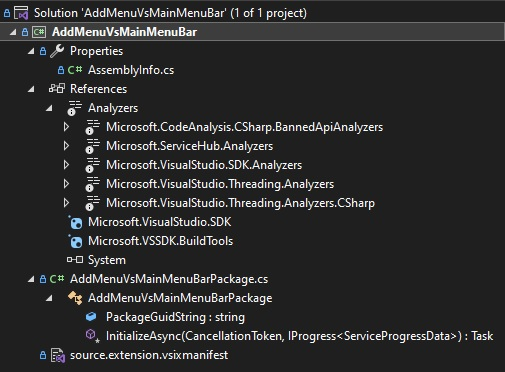
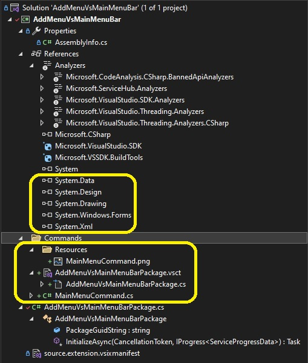
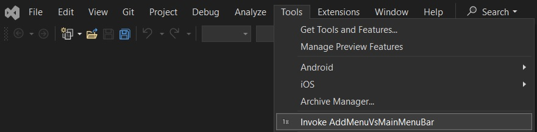
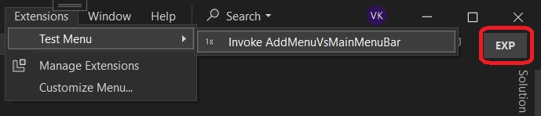
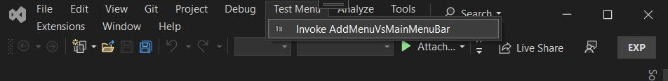

## Demos how to add a test menu directly to the main menu as follows. 

1.  Create a new project.

2.  Add new project as follows.

3. Now add commands folder 

4. Add a new command.

 

5. Note before and after adding the command, the changes in the project.

Before

After

6. Build and Run. You will see a command in Tools menu.

7. Click the command, you will see a message box. 

8. Now we will change this. [Take a look at this](https://learn.microsoft.com/en-us/visualstudio/extensibility/adding-a-menu-to-the-visual-studio-menu-bar). 

9. Impliment the chnages mentioned in the link.

10. Then build and run the app.

11. Now check Extension -> Test Menu

12. Now to make this into a menu on the tool bar take a look this [SO Answer](https://stackoverflow.com/a/76146656/1977871). 

13. Now debug again and launch the Exp.

14.  Take a look at the hierarchy. First the Button, the parent of which is a group. And the parent of the group is menu, or the top level menu. And the Menu's parent is the MainMenu.  