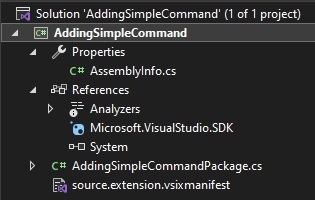
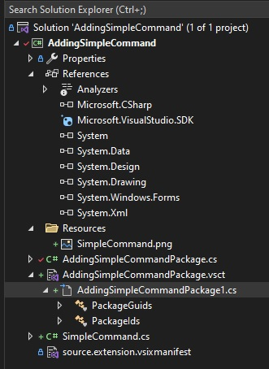
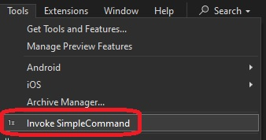
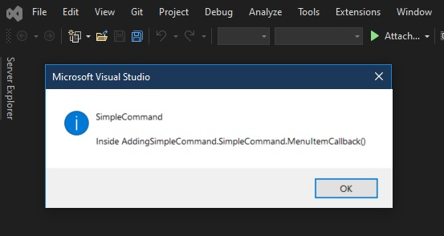

1.  Create a new project.

2.  Add new item as follows.

3. Note before and after adding the command, the changes in the project.

Before

After

So you see quite a few things get added as a result of the new item. 

4. Once you install, open visual studio and you will see the following. 

5. Once clicked, see the following.

