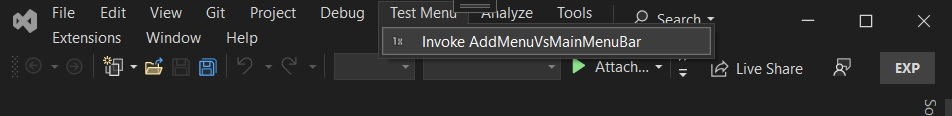
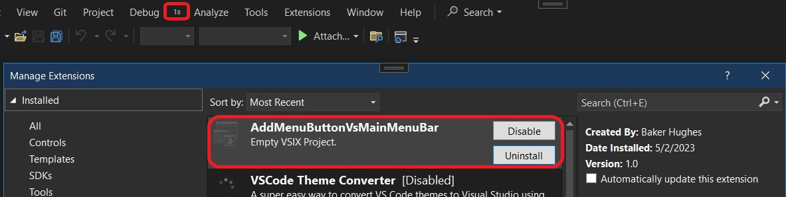

1. This example extends an earlier example. 501100-AddMenuVsMainMenuBar



2. We see there, Test Menu as a menu. And the menu has a button, which we can click. 

3. Can we make that as a button. So can the menu bar, itself have a button instead of a menu which holds a button? Lets try this in this example. 

4. Here we go...



5. We can see the icon. But there is no text. Probably the menu bar does not allow buttons. It allows only Menus

```xml
<Buttons>
    <Button guid="guidAddMenuButtonVsMainMenuBarPackageCmdSet" id="AddMenuButtonCommandId" priority="0x0100" type="Button">
        <Parent guid="guidSHLMainMenu" id="IDG_VS_MM_TOOLSADDINS" />
    <Icon guid="guidImages" id="bmpPic1" />
    <Strings>
        <ButtonText>Invoke AddMenuButtonCommand</ButtonText>
    </Strings>
    </Button>
</Buttons>
```

6. Note the parent of the button.

```xml
<Parent guid="guidSHLMainMenu" id="IDG_VS_MM_TOOLSADDINS" />
```

7. Also note that other IDSymbols are removed. There is only one left.

```xml
<GuidSymbol name="guidAddMenuButtonVsMainMenuBarPackageCmdSet" value="{15ec0eb6-41aa-4b61-8259-5e07eeb95f18}">
    <IDSymbol name="AddMenuButtonCommandId" value="0x0100" />
</GuidSymbol>
```

8. The parent is directly the MainMenu. In the earlier example, the hierarchy is Button, the parent of which is a group. And the parent of the group is menu. And the Menu's parent is the MainMenu. 

9. 