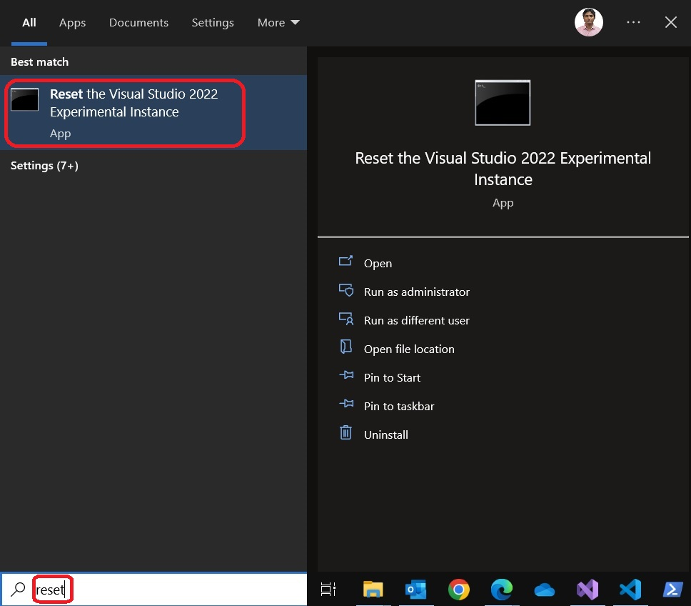

## Objective

1. This builds on an earlier example [501100-AddMenuVsMainMenuBar].  

2. This example adds and demos [ProvideAutoLoad attribute](https://learn.microsoft.com/en-us/dotnet/api/microsoft.visualstudio.shell.provideautoloadattribute). 

## References
1. https://learn.microsoft.com/en-us/visualstudio/extensibility/how-to-use-asyncpackage-to-load-vspackages-in-the-background#create-an-asyncpackage

2. https://learn.microsoft.com/en-us/previous-versions/visualstudio/visual-studio-2017/extensibility/how-to-use-asyncpackage-to-load-vspackages-in-the-background?view=vs-2017#create-an-asyncpackage
   
3. https://learn.microsoft.com/en-us/visualstudio/extensibility/adding-a-menu-to-the-visual-studio-menu-bar
   
4. https://www.youtube.com/watch?v=p328QcgZObs&t=526s


## Notes
```cs
[PackageRegistration(UseManagedResourcesOnly = true, AllowsBackgroundLoading = true)]
[Guid(ProvideAutoLoadPackage.PackageGuidString)]
[ProvideMenuResource("Menus.ctmenu", 1)]
[ProvideAutoLoad(VSConstants.UICONTEXT.NoSolution_string, PackageAutoLoadFlags.BackgroundLoad)]
[ProvideAutoLoad(VSConstants.UICONTEXT.SolutionExists_string, PackageAutoLoadFlags.BackgroundLoad)]
public sealed class ProvideAutoLoadPackage : AsyncPackage
{

}
``` 

1. Consider the attributes applied above. Take a look at the YouTube ref: https://www.youtube.com/watch?v=p328QcgZObs&t=526s
```cs
[ProvideAutoLoad(VSConstants.UICONTEXT.NoSolution_string, PackageAutoLoadFlags.BackgroundLoad)]
[ProvideAutoLoad(VSConstants.UICONTEXT.SolutionExists_string, PackageAutoLoadFlags.BackgroundLoad)]
```

2. So they are not events. Think of them as states. https://www.youtube.com/watch?v=p328QcgZObs&t=565s

3. Try running debugging this app with and without the above attributes. Each time you run the app, ensure to reset the exp vs as follows.



4. Visual studio doesn’t load the Command until first use. Which means, our Command’s constructor of the package won’t be called.

5. If we need to make our Command to initialize at Visual Studio startup, that is, if we need our ctor to be called at start up, we need to do a bit more. To do that, we need to make our VSPackage to initialize at startup. This is done with the ProvideAutoLoad attribute in the package class file.

```cs
public ProvideAutoLoadPackage()
{
    System.Diagnostics.Debugger.Break();
}

protected override async Task InitializeAsync(CancellationToken cancellationToken, IProgress<ServiceProgressData> progress)
{
    System.Diagnostics.Debugger.Break();
    // When initialized asynchronously, the current thread may be a background thread at this point.
    // Do any initialization that requires the UI thread after switching to the UI thread.
    await this.JoinableTaskFactory.SwitchToMainThreadAsync(cancellationToken);
    await ProvideAutoLoad.Commands.ATrialCommand.InitializeAsync(this);
}
```

6. So when you have the attributes, then the above two break points are hit during the start of the visual studio when the packages are loaded. The package is loaded when the visual studio starts.

7. This is not very efficient, because the package is loaded and the command may never be invoked at all.

8. But when you comment out the attributes, then the above two break points are hit when the command is invoked. The package is loaded when the command is invoked. The package is loaded NOT when the visual studio starts.  

9. We have the attribute twice: When there’s no Solution, and when Solution exists. Which covers all cases. Also, note the PackageAutoLoadFlags.BackgroundLoad flag. This important flag states that our packages can initialize asynchronously on a background thread.


