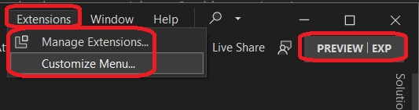
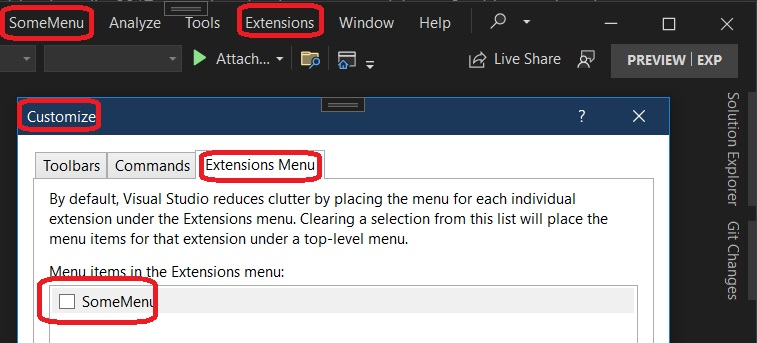

## Objective

1. This builds on [task](https://github.com/AvtsVivek/LearnVsExt/tree/main/src/tasks/501125-ProvideAutoLoad) and [app](https://github.com/AvtsVivek/LearnVsExt/tree/main/src/apps/501125-ProvideAutoLoad).  

2. This example this tut on [the net here ](https://michaelscodingspot.com/visual-studio-2017-extension-development-tutorial-part-2-add-menu-item/). 

3. References
   1. https://michaelscodingspot.com/visual-studio-2017-extension-development-tutorial-part-2-add-menu-item/

4. Visual studio doesn’t load the Command until first use. Which means, our Command’s constructor won’t be called and our menu item will be in its default state – unchecked, regardless of the setting’s value.

5. We need to make our Command to initialize at Visual Studio startup. To do that, we need to make our VSPackage to initialize at startup. This is done with the ProvideAutoLoad attribute in the package class file CheckableMenuCommandPackage.cs

6. This example is not very clear. Need to come back here again.

7. Run the app, Exp instance is launched. Go to Extensions ->  Customize Menu

8. Uncheck it.

9. Its not clear what enabling and disable does. Need to look into this. For now, ignoring it. 

