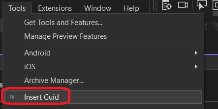

1. Shows how to insert some text, Guid in this case, into a text file, when a command is invoked.

2. The invoked command is in the tools menu. 

3. Here we are using [DTE](https://learn.microsoft.com/en-us/dotnet/api/envdte) 

4. DTE stands from Development Tools Environment

   1. https://stackoverflow.com/a/17239968/1977871

5. Ensure the ExecuteAsync is as follows. 

```cs
private async void ExecuteAsync(object sender, EventArgs e)
{
    await ThreadHelper.JoinableTaskFactory.SwitchToMainThreadAsync();

    var dte = await ServiceProvider.GetServiceAsync(typeof(DTE)) as DTE;
    Assumes.Present(dte);

    var activeDocument = dte.ActiveDocument;

    if (activeDocument == null)
    {
        string message = string.Format(CultureInfo.CurrentCulture, "No document is open.", this.GetType().FullName);
        string title = "InsertGuidCommand";
        // Show a message box to prove we were here
        VsShellUtilities.ShowMessageBox(
            this.package,
            message,
            title,
            OLEMSGICON.OLEMSGICON_INFO,
            OLEMSGBUTTON.OLEMSGBUTTON_OK,
            OLEMSGDEFBUTTON.OLEMSGDEFBUTTON_FIRST);
        return;
    }

    var textDocument = (TextDocument)(dte.ActiveDocument.Object("TextDocument"));

    var textSelection = activeDocument.Selection as TextSelection;

    textSelection.Text = Guid.NewGuid().ToString();

    activeDocument.Save();

}
```

5. Open any text file in the code window by opening, a file, project or a solution. Plece cursor any where or select some text.

6. Now try the command as folllows.


7. There is another way to manipulate the text of a document. See [this](https://github.com/AvtsVivek/LearnVsExt/tree/main/src/tasks/552400-VsixCommunityInsertGuid) and [this app](https://github.com/AvtsVivek/LearnVsExt/tree/main/src/apps/552400-VsixCommunityInsertGuid).

8. Using DTE to get the document object and then getting the selection as shown in this example is one way. Without using DTE, getting this selection is more tedious. For such an example, search for an example which has  TextViewSelection and TextViewPosition in this repository. You should see GetSelection and GetSelectionShowPopup projects.

