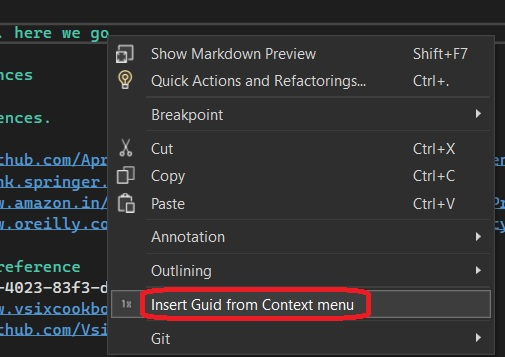
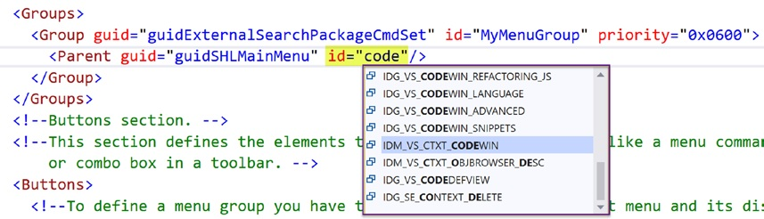

1. Shows how to insert some text, Guid in this case, into a text file, when a command is invoked.

2. The invoked command is in the context menu. Select some text and right click.

3. You can use intellisence in vsct file as follows. You need this [VSCT IntelliSense 2022 extension](https://marketplace.visualstudio.com/items?itemName=MadsKristensen.VsctIntelliSense2022)

4. 