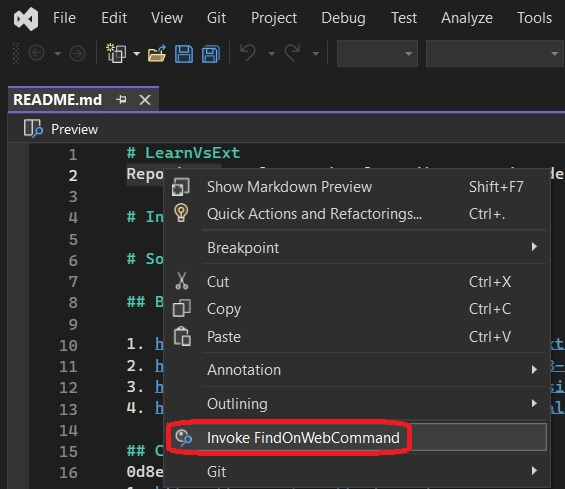
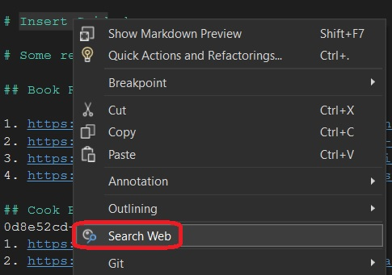
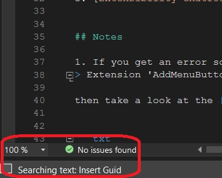

1. Objective: 

2. Prereqs
   1. 500670-AssignKeyboardShortcut. 
   2. 500705-AddingMonikerIcon. 
   3. 501135-InsertGuidMenuCmd. This introduces DTE 
   4. 501140-InsertGuidContextMenu. 


3. Use IDM_VS_CTXT_CODEWIN instead of IDM_VS_MENU_TOOLS
```cs
<Group guid="guidSimpleWebSearchPackageCmdSet" id="MyMenuGroup" priority="0x0600">
   <Parent guid="guidSHLMainMenu" id="IDM_VS_CTXT_CODEWIN"/>
</Group>
```

4. Add Search Moniker. Next, include the following in the code. By this we are telling the package that we are using the visual studio known moniker icons.
```xml
<Include href="KnownImageIds.vsct"/>
```

5. Now add the following icon tag. So basically we are replacing the above guidImage one with the following.

```xml
<Icon guid="ImageCatalogGuid" id="SearchMember"/>
<CommandFlag>IconIsMoniker</CommandFlag>
```

6. Remove the following. Open VSCT file, the Visual Studio Command Table file. We dont want to use the default png file. So delete the following.

```xml
<GuidSymbol name="guidImages" value="{532d1e76-0759-4f17-8249-a459c36252f1}" >
    <IDSymbol name="bmpPic1" value="1" />
    <IDSymbol name="bmpPic2" value="2" />
    <IDSymbol name="bmpPicSearch" value="3" />
    <IDSymbol name="bmpPicX" value="4" />
    <IDSymbol name="bmpPicArrows" value="5" />
    <IDSymbol name="bmpPicStrikethrough" value="6" />
</GuidSymbol>
```
and 

```xml
<Bitmaps>
    <Bitmap guid="guidImages" href="Resources\MainMenuCommand.png" usedList="bmpPic1, bmpPic2, bmpPicSearch, bmpPicX, bmpPicArrows, bmpPicStrikethrough"/>
</Bitmaps>
```

and finally 

```xml
<Icon guid="guidImages" id="bmpPic1" />
```

Build and Run. Open any document in the code windows. Rightclick and ensure a command. 



1. Add the following properties to the command class.

```cs
public static IVsOutputWindowPane OutputWindow
{
    get;
    private set;
}

public static DTE2 DteInstance
{
    get;
    private set;
}
```

8. Next populate the above prope as follows in InitializeAsync 

```cs
OutputWindow = await package.GetServiceAsync(typeof(SVsGeneralOutputWindowPane)) as IVsOutputWindowPane;
Assumes.Present(OutputWindow);
DteInstance = await package.GetServiceAsync(typeof(DTE)) as DTE2;
Assumes.Present(DteInstance);
```

9. Reimpliment Execute the method

```cs
private void Execute(object sender, EventArgs e)
{
    ThreadHelper.ThrowIfNotOnUIThread();
    var activeDocument = DteInstance?.ActiveDocument;
    var textSelection = activeDocument?.Selection as TextSelection;

    if (textSelection == null)
    {
        DteInstance.StatusBar.Text = "No Text selected";
        return;
    }

    var textToBeSearched = textSelection?.Text.Trim();

    if (string.IsNullOrWhiteSpace(textToBeSearched))
    {
        DteInstance.StatusBar.Text = "No Text selected";
        return;
    }

    DteInstance.StatusBar.Text = string.Empty;
    DteInstance.StatusBar.Text = $"Searching text: {textToBeSearched}";    
    OutputWindow.OutputStringThreadSafe($"Searching text: {textToBeSearched}");

    var url = $"https://www.bing.com/search?q={textToBeSearched}";
    var encodedText = HttpUtility.UrlEncode(textToBeSearched);
    var encodedUrl = string.Format(url, encodedText);

    System.Diagnostics.Process.Start(encodedUrl);
}
```

10. Finally change the button text more appropriate string.
```xml
<ButtonText>Search Web</ButtonText>
```

11.  Now build and run. Open some file, select some text and right click. 

    

12. Status bar text.

    

12.  Also try without selecting any text, just rightclick anywhere on the file, and see.

13.  Next need know more about Options and  
     1. https://learn.microsoft.com/en-us/visualstudio/extensibility/creating-an-options-page
     2. https://learn.microsoft.com/en-us/visualstudio/extensibility/creating-a-settings-category
     3. https://learn.microsoft.com/en-us/visualstudio/extensibility/extending-user-settings-and-options
     4. https://learn.microsoft.com/en-us/visualstudio/extensibility/internals/support-for-user-settings
     5. https://learn.microsoft.com/en-us/previous-versions/cc826083(v=vs.140)
     6. https://learn.microsoft.com/en-us/visualstudio/extensibility/internals/options-and-options-pages


