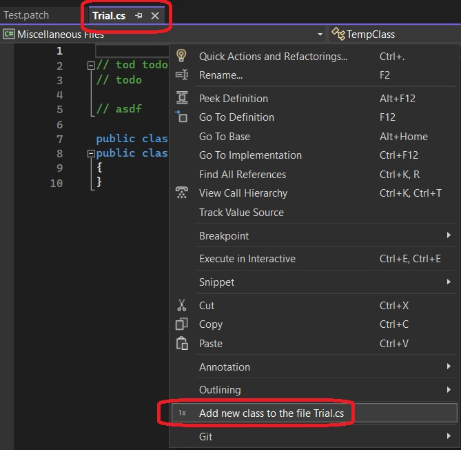
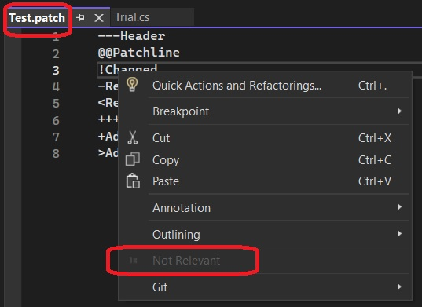

## Introduction

1. Introduces Ole Menu Command 

## References: 

1. https://learn.microsoft.com/en-us/previous-versions/visualstudio/visual-studio-2015/misc/menucommands-vs-olemenucommands?preserve-view=true&view=vs-2015

## Scenario

1. Say, 
   1. a text file is opened in Visual STudio editor. You right click it, and you want a command on the context menu. 
   2. The command should be enabled only for file with extension of .cs. Note that we are talkinb about enabling and disabling and not visible and invisible.
   3. Files with other extensions, when right clicked, on the context menu, the command should be present but should be disabled.
   4. Also if it is a .cs file, the text on the enabled command should be **Add new class to the file**. And if the the file extension is different, then the text should be, say **Not Relevant** 
2. asdf

# Steps.

1. Create a new VSIX package. Then add a new folder Commands, and add a new command to it.

2. In the command table file OleMenuCommandIntroPackage.vsct, ensure the parent of the group is **IDM_VS_CTXT_CODEWIN** so that the command is on the context menu.

```xml
<Parent guid="guidSHLMainMenu" id="IDM_VS_CTXT_CODEWIN"/>
```

3. Change MenuCommand to OleMenuCommand and add an event handler to beforeQueryStatus

4. To the package class, add attributes as follows.

```cs
[ProvideAutoLoad(VSConstants.UICONTEXT.NoSolution_string, PackageAutoLoadFlags.BackgroundLoad)]
[ProvideAutoLoad(VSConstants.UICONTEXT.SolutionExists_string, PackageAutoLoadFlags.BackgroundLoad)]
  
```

5. In the Visual Studio Command Table file, vsct file, add the following tags

```xml
<CommandFlag>TextChanges</CommandFlag>
```

6. Change MenuCommand to OleMenuCommand.

7. Add handler to OleMenuCommand object event BeforeQueryStatus.  

'''cs
var menuItem = new OleMenuCommand(this.Execute, menuCommandID);
menuItem.BeforeQueryStatus += OnBeforeQueryStatus;
'''

The event handler

```cs
private async void OnBeforeQueryStatus(object sender, EventArgs e)
{ ... }
```

8. Run the app, and open differnt kinds of files.
9. First cs file.



10. Now the Any other extension file.



11. 