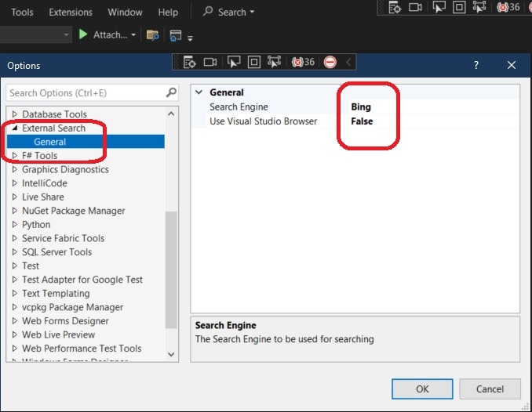
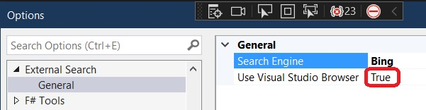
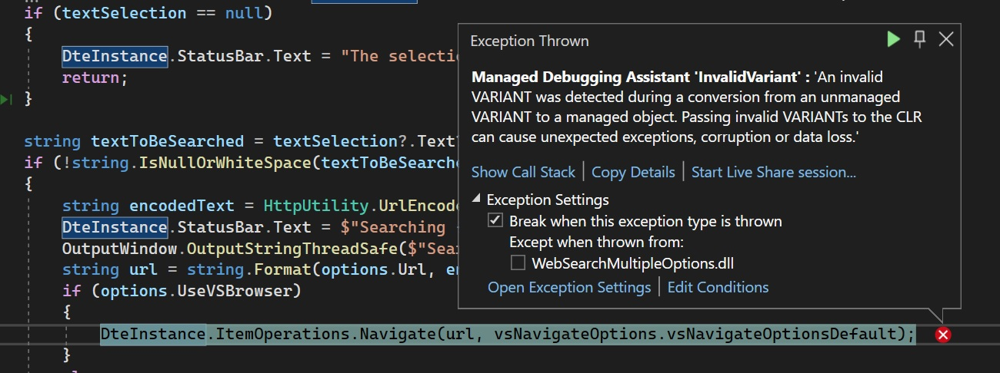
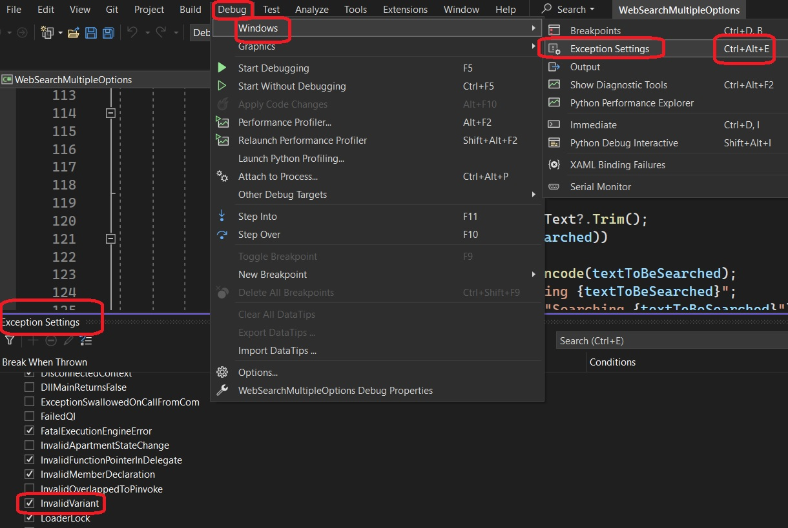
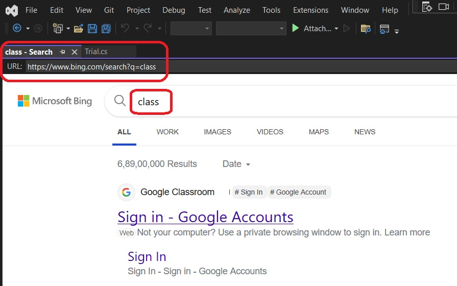
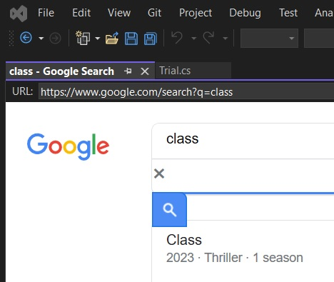

1. Objective: Build an extension which will help search a selected text on web(with options, bing, google etc.).

2. Prereqs
   1. 501300-SimpleWebSearch.

3. Add ExternalSearchOptionPage class.

4. To uniquely identify this newly created ExternalSearchOptionPage class as our extension's option page, we need to assign a GUID to this class by means of a GUID attribute. Since we have the Insert GUID extension installed as part of the Extensibility Essentials 2019 extension pack, we can right-click on the code window and then click on Insert GUID in the context menu.
5. Add the attribute to the package class.
```cs
[ProvideOptionPage(typeof(ExternalSearchOptionPage), "External Search", "General", 1, 1, true, new string[] { "External Search Options"})]
```
6. Add an enum as follows.
```cs
public enum SearchEngines
{
   Bing = 0,
   Google,
   MSDN,
   StackOverflow
}
```
7. Add the following attribute to the package class
```cs
[ProvideOptionPage(typeof(ExternalSearchOptionPage), "External Search", "General", 1, 1, true, new string[] { "External Search Options" })]
```
8. Finally the execute method should be as follows.
```cs
private void Execute(object sender, EventArgs e)
{
   ThreadHelper.ThrowIfNotOnUIThread();
   var options = this.package.GetDialogPage(typeof(ExternalSearchOptionPage)) as ExternalSearchOptionPage;
   TextSelection textSelection = DteInstance?.ActiveDocument?.Selection as TextSelection;
   if (textSelection == null)
   {
         DteInstance.StatusBar.Text = "The selection is null or empty";
         return;
   }

   string textToBeSearched = textSelection?.Text?.Trim();
   if (!string.IsNullOrWhiteSpace(textToBeSearched))
   {
         string encodedText = HttpUtility.UrlEncode(textToBeSearched);
         DteInstance.StatusBar.Text = $"Searching {textToBeSearched}";
         OutputWindow.OutputStringThreadSafe($"Searching {textToBeSearched}");
         string url = string.Format(options.Url, encodedText);
         if (options.UseVSBrowser)
         {
            DteInstance.ItemOperations.Navigate(url, vsNavigateOptions.vsNavigateOptionsDefault);
         }
         else
         {
            System.Diagnostics.Process.Start(url);
         }
   }
   else
   {
         DteInstance.StatusBar.Text = "The selection is null or empty";
   }
}
```
9. Now build and run. 



10. Now try with Use Visual Studio Browser as true.



You may get an exception as follows.



Then go to the exception settings as follows. Find Invalid Varient and uncheck it. Then run again.



This time, you will not see the exception. Now, the visual studio browser is used instead of extenal browser.



11. Now try with Google instead of Bing and Visual Studio Browser as well. 



