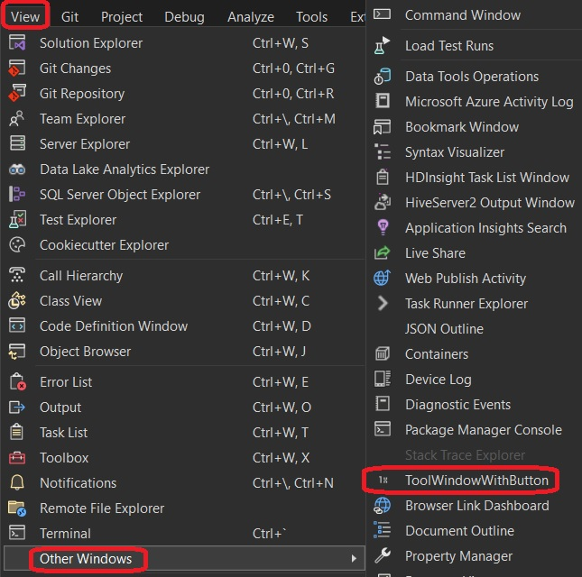

## Simple Tool Window Extension

1. This is based on the following You tube video.
   1. https://www.youtube.com/watch?v=u0pRDM8qW04

2. Reference.
   1. https://learn.microsoft.com/en-us/visualstudio/extensibility/internals/guids-and-ids-of-visual-studio-menus#submenus-of-visual-studio-menus

3. Build the project and start debugging. The Visual Studio experimental instance should appear.
   
4. On the View / Other Windows menu, click ToolWindowWithButton.

5. 

