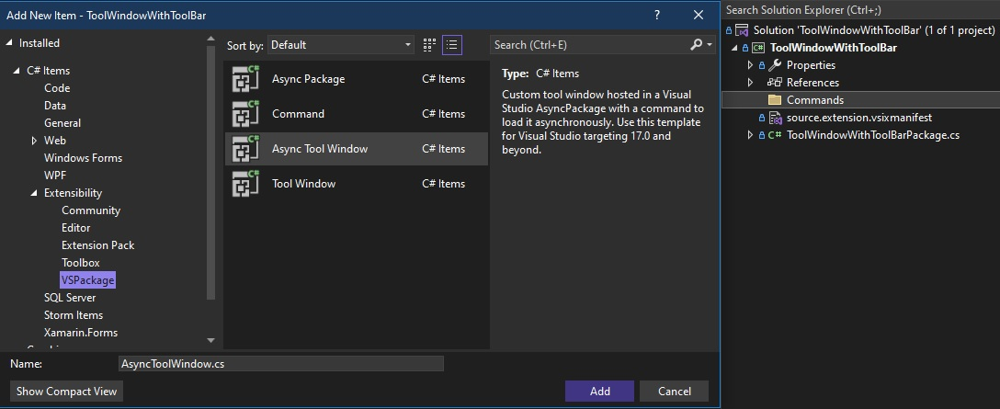
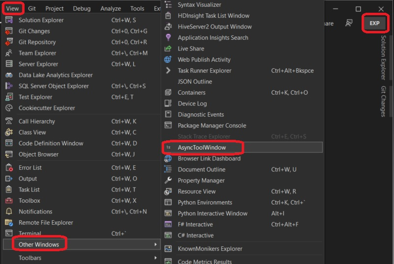
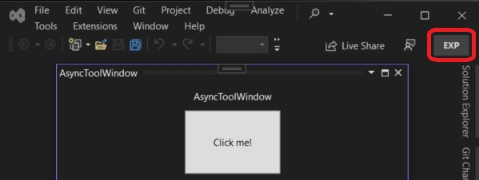

## Simple Tool Window Extension

1. This is based on the following.
   1. https://learn.microsoft.com/en-us/visualstudio/extensibility/adding-a-toolbar-to-a-tool-window

2. Steps to create.
   1. Create a VSix project. Add a commands folder.
   
   2. Add Async Tool Window to the commands folder.
   
   
   3. Build and run.
   
   And the window
         
   4. 

3. 