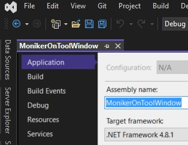
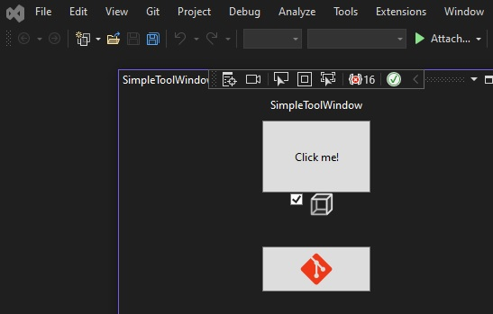

## Moniker icon on a tool window.
1. Demos how to add Visual Studio Moniker icons to Xaml Tool window.

2. This is built on the 502500-SimpleToolWindow.

3. Changed the project properties, targent frame work to 4.8.1
   

4. Now add the following code to the xmal file.

5. First add the namespaces.
```xml
xmlns:vsimaging="clr-namespace:Microsoft.VisualStudio.Imaging;assembly=Microsoft.VisualStudio.Imaging"
xmlns:vsimagecat="clr-namespace:Microsoft.VisualStudio.Imaging;assembly=Microsoft.VisualStudio.ImageCatalog"
xmlns:vstheming="clr-namespace:Microsoft.VisualStudio.PlatformUI;assembly=Microsoft.VisualStudio.Imaging"
```

6. Next a resource for the user control.

```xml
<UserControl.Resources>
    <vsimaging:CrispImage x:Key="MyImage" Width="40"
										Height="40"
										Moniker="{x:Static vsimagecat:KnownMonikers.Git}" />
</UserControl.Resources>
```

7. Now modify or add element as follows.

```xml
<CheckBox Width="60" Height="60" ToolTip="Git Mode" IsChecked="True">
	<vsimaging:CrispImage Width="30" Height="30" Moniker="{x:Static vsimagecat:KnownMonikers.AbstractCube}" />
</CheckBox>
<Button Width="120" Height="50" Name="button2"	Content="{StaticResource MyImage}"  />
```

7. Build and run the app.
   

8. 