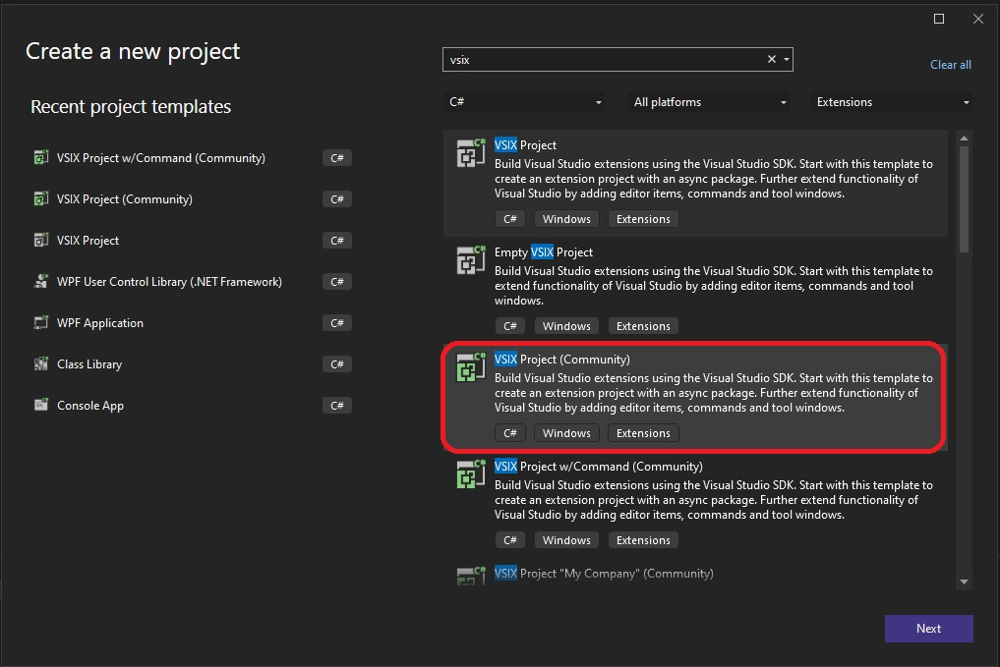

1. Using the following template.

2. There is nothing in this. No command.

## References
1. https://learn.microsoft.com/en-us/visualstudio/extensibility/vsix/get-started/first-extension
2. https://www.vsixcookbook.com/getting-started/your-first-extension.html
3. 