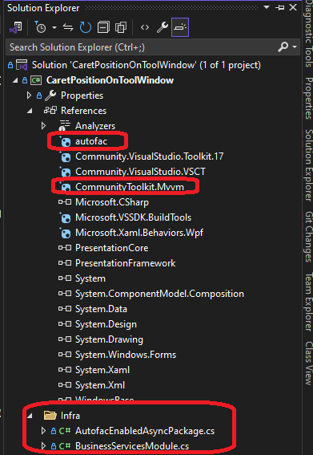

# DTE Events, Build Events

## Objective
1. The primary objective is to know the cursor or caret position when a text file is opned. 
2. The caret position be displayed on a tool window.

## How this project is built.
1. Start with Community project template.

2. Add regular tool window, not community one. Not the following one.

3. Add autofac for dependency injection. Refer to AutofacDiIntro project.

4. Configure MVVM

5. Add `CaretPositionToolWindowViewModel`, `DocumentService` etc.

## Build and Test
1. Launch the app and View -> Other Windows -> CaretPositionToolWindow

2. This opens the tool window.

3. At this point, no file is opened, be it text file, or a non text file, such as image file.

4. Note the second row whose label reads as `Win Frame & Doc Count`. Since no files are opened it show 0 and 0.

5. There is clear textbox button, click it to clear of the messages. 

6. Open a couple of text files Trial.cs and Class1.cs. 

7. Win Frame count is total numer of files, any type be it, text files or non text files. Doc count is text files. At this point both are 2.

8. You can see the cursor position as well.

9. Similarly check by opening non text files as follows.

10. Note, when the currently opened file is a non text file, the cursor position shows non text files. 

## Notes.
1. This example demonistrates, various events. Look at the view model file.

## References
1. SimpleToolWindows example.
2. HighlightWord example. 
3. VsTextManagerIntro example.
4. CommunityActiveProcess example.
5. asdfasdf
6. asdfasdf
7. asdfsadf

