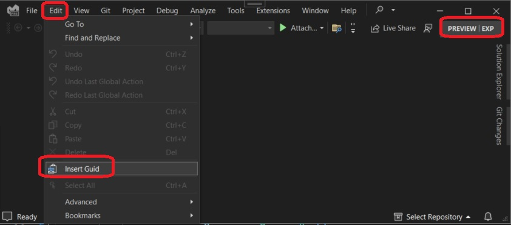
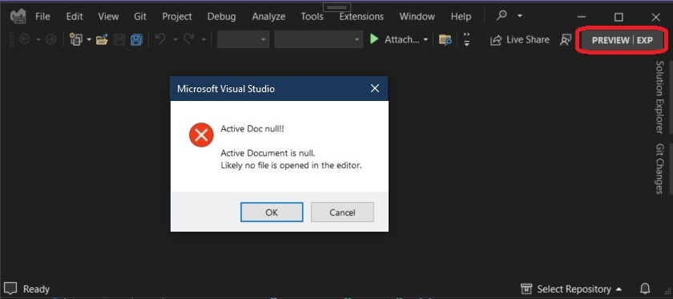

Reference

https://github.com/VsixCommunity/Samples/tree/master/InsertGuid

Use the following.

Once installed, my command.

Solution Explorer.

The File changes to the VSCommandTable.vsct are as follows.

Invoke the Command without any file opened in the editor. 

You will get a Message as follows.

Now open any text file, then place the curser where you want to insert a randonly generated Guid.

Insert Guid

