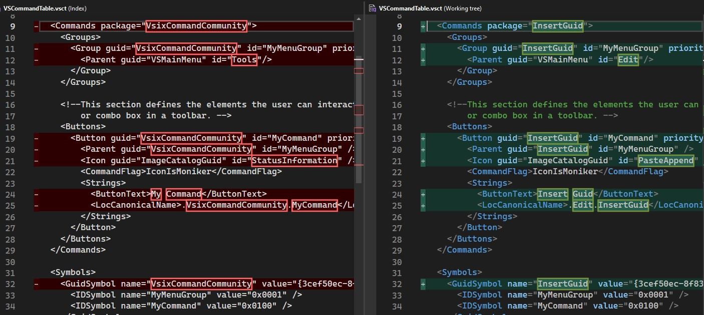
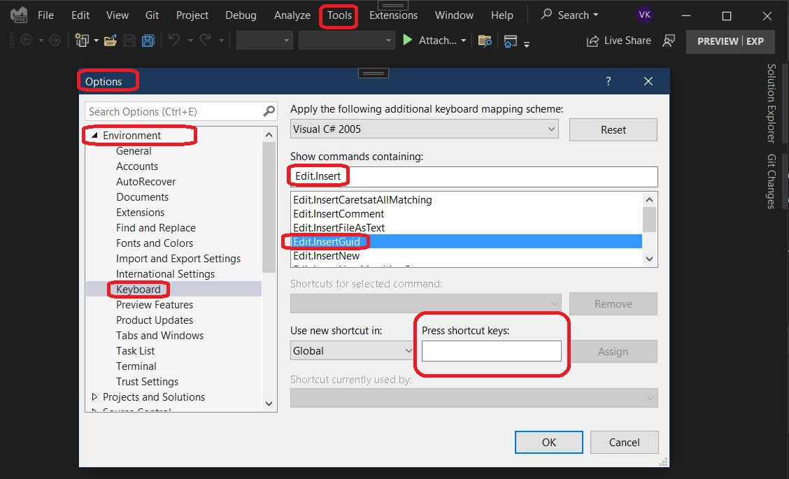

# VSixCommunity Command Example.

## References
 
https://github.com/VsixCommunity/Samples/tree/master/InsertGuid

https://learn.microsoft.com/en-us/visualstudio/extensibility/vsix/get-started/first-extension

https://www.vsixcookbook.com/getting-started/your-first-extension.html

https://www.vsixcookbook.com/recipes/menus-buttons-commands.html#define-the-command

## How this project is built.

Use the following.

Once installed, my command.

Solution Explorer.

The File changes to the VSCommandTable.vsct are as follows.

## Build and Run

Invoke the Command without any file opened in the editor. 

You will get a Message as follows.

Now open any text file, then place the curser where you want to insert a randonly generated Guid.

Insert Guid

## Notes.

1. If you want the end user to have the option of assigning a keyboard shortcut to the command, you need to follow this. 
2. The <LocCanonicalName> will have the technical name of the command - this is the name shown users when they assign custom keyboard shortcuts to your command in the Tools -> Options -> Environment -> Keyboard dialog.

3. See the following for <LocCanonicalName> 
   1. https://www.vsixcookbook.com/getting-started/your-first-extension.html#modify-command
   
   2. https://learn.microsoft.com/en-us/visualstudio/extensibility/vsix/get-started/first-extension#modifying-the-command

4. the Tools -> Options -> Environment -> Keyboard dialog is as follows.

4. The end user can now assign a keyboard shortcut to the command in this way.

