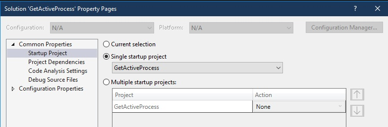
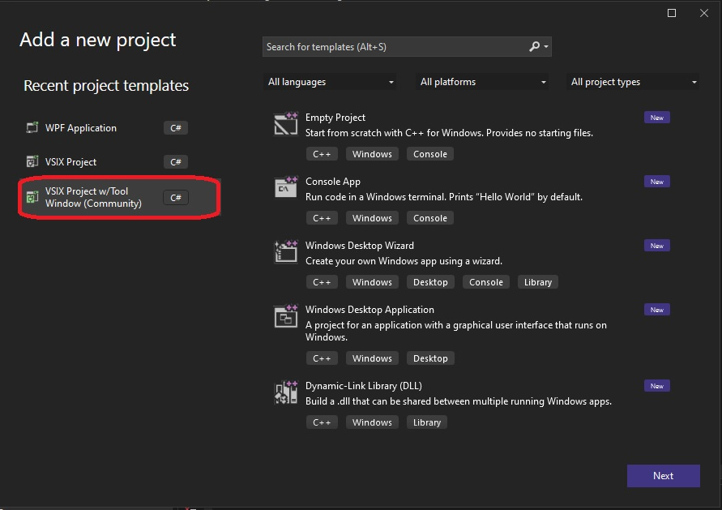
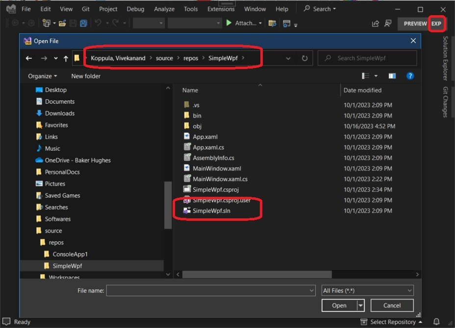
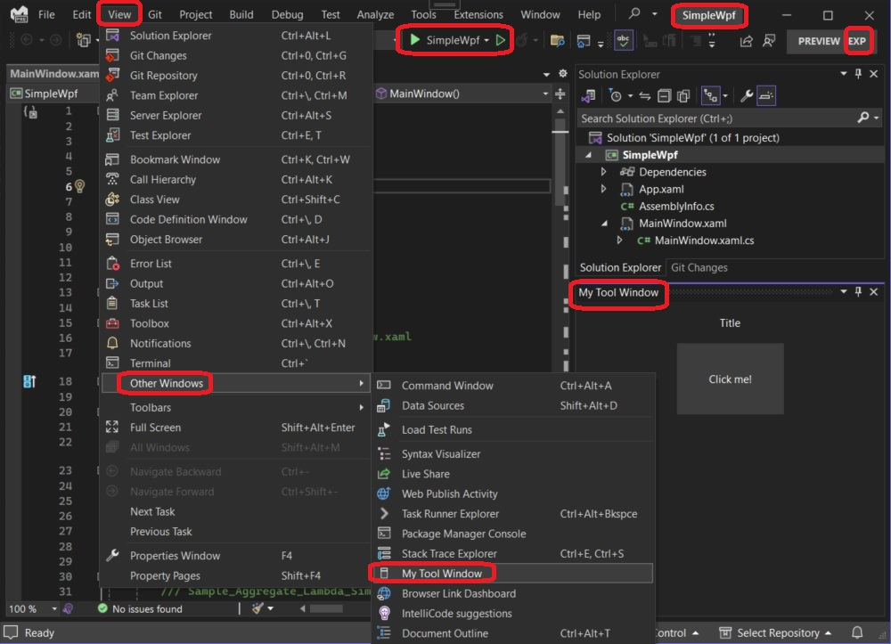
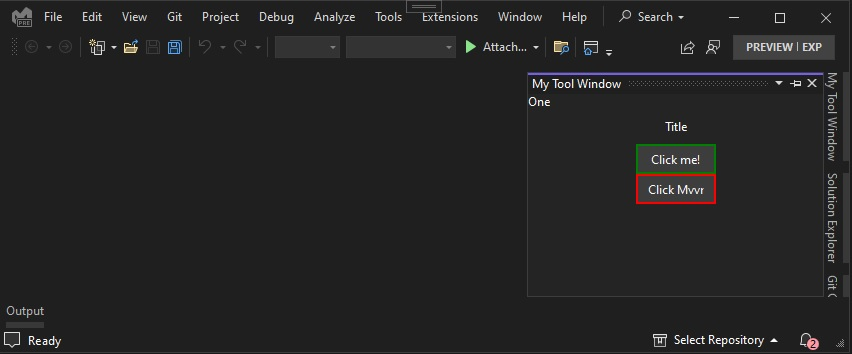
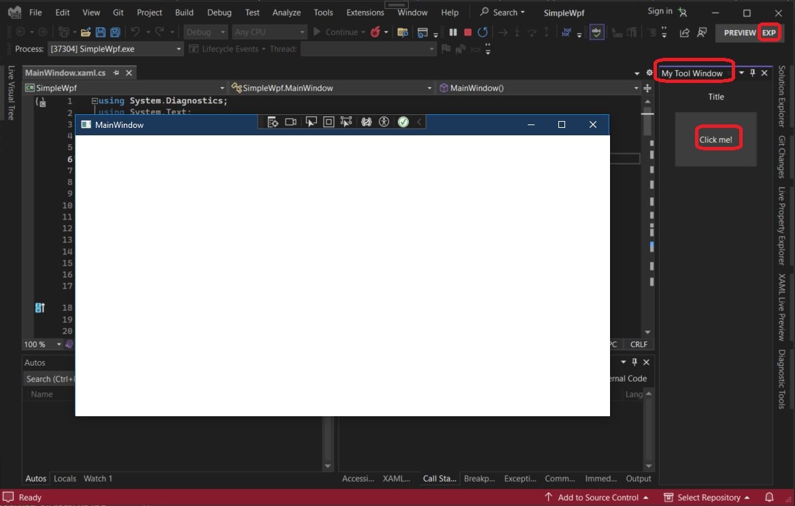

# Gets the active process 

## Objective
1. Visual Studio is for developing application, and during development, we want to load solutions, build and run them. 

2. When we run a solution, they start processes. They can be more than one, when we setup more then one startup projets.



3. We then press F5 to start running the projects. 

4. This example demonistrates how an extension can get more information about such apps(processes) which Visual Studio is running and debugging. 

5. This example also introduces Mvvm in the application.

6. So this example gets the details of active process when a button on the tool window is clicked. Also introduces Mvvm in its native form.

## References
1. How to get currently running project from Visual Studio extension
   1. https://stackoverflow.com/a/36260234/1977871

2. https://learn.microsoft.com/en-us/dotnet/api/envdte.debugger

3. https://learn.microsoft.com/en-us/dotnet/api/envdte100.debugger5

## How this project is built.
1. Created using the a new Communit Tool kip project with tool window as follows.



2. Added the method, GetCurrentModeAndRunningProcess.

3. This example introduces Mvvm natively, that is, without any tool kit or Mvvm framework. So added a folder and files in MvvmInfra folder. 

## How to run
1. Build and Press F5, and exp instance will start. 
2. Then open a wpf solution.



3. Open the tool window



4. Added the Mvvm pattern as well. The second button now works using Mvvm command.



5. Then run the solution, and then click the button. 



## Notes
1. You can get the current mode. CurrentMode, 
   1. dbgDebugMode.dbgDesignMode, Design Mode
   2. dbgDebugMode.dbgBreakMode, Break Mode
   3. dbgDebugMode.dbgRunMode, Run Mode

2. First we get the DTE object 

```cs
var dte = ServiceProvider.GlobalProvider.GetService(typeof(DTE));            
var dte2 = dte as DTE2;
```

3. Then from DTE, we get the process object. Take a look at the method GetCurrentModeAndRunningProcess

4. 
