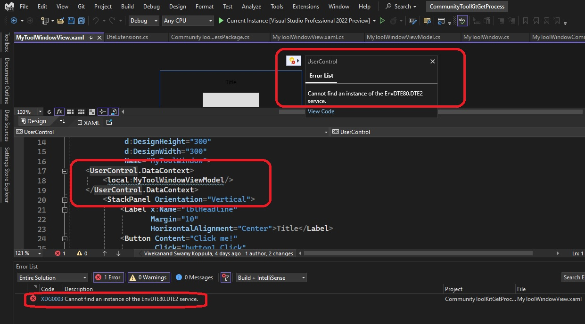

# Tool window which shows the active process

## Todo WIP

## Objective
1. The earlier example 552450-CommunityActiveProcess Gets the details of active process when a button on the tool window is clicked. Also introduces Mvvm in its native form.

2. This example uses Community Tool kit for Mvvm, see the references below.

3. 


## References
1. https://github.com/CommunityToolkit/dotnet/tree/main/src/CommunityToolkit.Mvvm

2. https://learn.microsoft.com/en-us/dotnet/communitytoolkit/mvvm/

3. https://github.com/CommunityToolkit/dotnet/tree/main/tests/CommunityToolkit.Mvvm.UnitTests

4. https://github.com/CommunityToolkit/MVVM-Samples

5. https://stackoverflow.com/q/2801985/1977871

6. https://www.nuget.org/packages/Ardalis.SmartEnum/2.1.0

7. https://www.nuget.org/packages/Ardalis.SmartEnum

8. https://github.com/ardalis/SmartEnum

## How this project is built.
1. Starts from the earlier example 552450-CommunityActiveProcess
2. Note the following three examples introduces events.
   1. 503500-SolutionEventsIntro
   2. 503530-BuildEventsIntro
   3. 503560-DebuggerEventsIntro


## Design time issues.
1. For design time issues you see below, we need to ignore this for now.



2. The designer is trying to create an instance, but in the ctor, it cannot create an instance of the DTE
3. To avoid such issue, we should use on loaded event instead of ctor. 
4. But to have events as command, you need to use interactivity.

```xaml
    xmlns:ei="http://schemas.microsoft.com/expression/2010/interactions"
    xmlns:i="http://schemas.microsoft.com/expression/2010/interactivity"

.....

   <i:Interaction.Triggers>
      <local:ScrollTrigger>
         <ei:ChangePropertyAction PropertyName="IsOpen" Value="False" />
      </local:ScrollTrigger>
   </i:Interaction.Triggers>
```

5. But interactivity is old, and introduces another error.

> The name "Interaction" does not exist in the namespace "http://schemas.microsoft.com/expression/2010/interactivity"

6. https://stackoverflow.com/q/20743961/1977871

7. To fix that, we need to behaviours. 

8. https://stackoverflow.com/a/61547718/1977871

8. This poses another problem. Behaviours need a [nuget package](https://www.nuget.org/packages/Microsoft.Xaml.Behaviors.Wpf). But as on today, the project must target either .NET 6 or .NET Framework 4.6.2. Our project targes 4.8.2. So this also wont work. 

## Notes
1. If a solution has multiple projects, and you want to be notified when all of the projects are built, then see [this so answer.](https://stackoverflow.com/a/2802636/1977871) and then [this one](https://stackoverflow.com/a/13515072/1977871). So we added this dictionary. _multipleProjectBuildStatus

2. Note that for BuildStatus, we used SmartEnum. This may be an overkill for this example.

3. 

