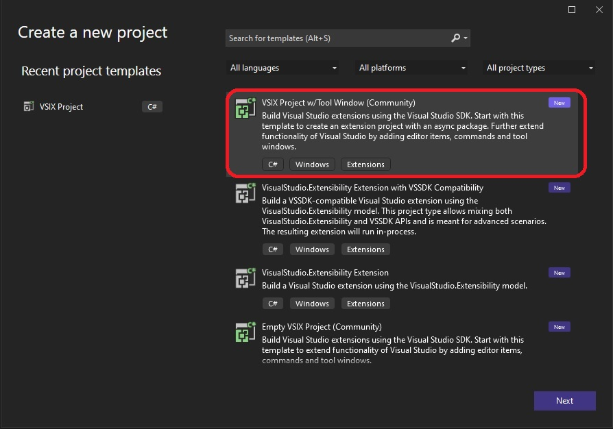
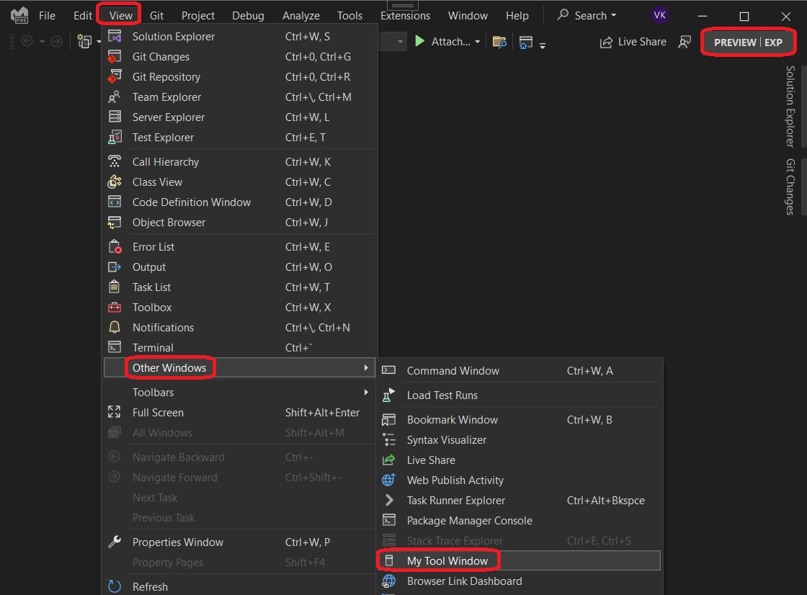
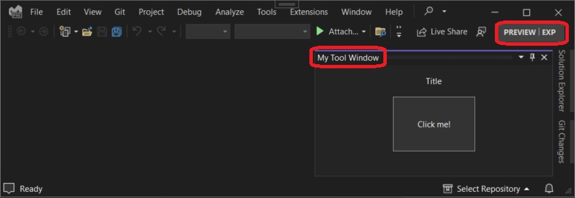

# VsixCommunity Tool Window.

## References
 
1. https://github.com/VsixCommunity/Samples/tree/master/ToolWindow

2. https://learn.microsoft.com/en-us/visualstudio/extensibility/vsix/recipes/custom-tool-windows

3. https://www.vsixcookbook.com/recipes/custom-tool-windows.html

## How this project is built.

Use the following.

1. Create a new projct.
   

2. Configure the project.
   

3. Update the nuget packages.
   1. https://www.nuget.org/packages/Community.VisualStudio.VSCT
   2. https://www.nuget.org/packages/Community.VisualStudio.Toolkit.17
   3. https://www.nuget.org/packages/Microsoft.VSSDK.BuildTools

4. 

## Build and Run

1. The exp instance is as follows.
   

2. The tool window
   

3. 

