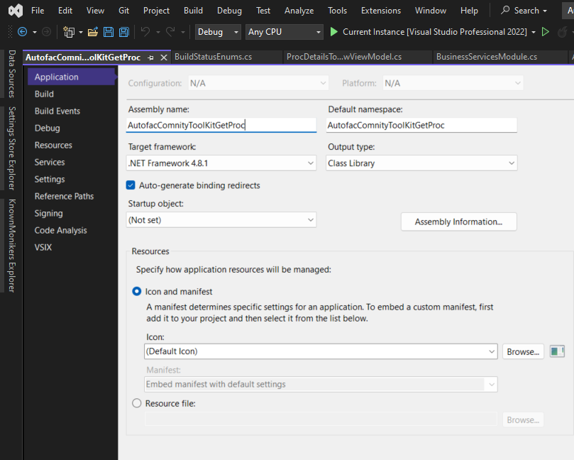
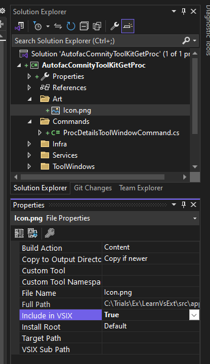
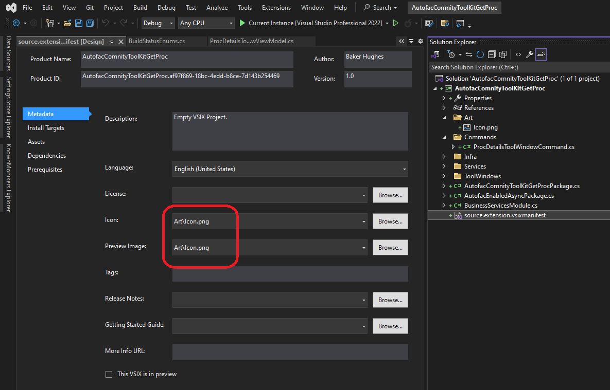
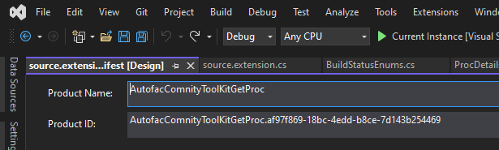
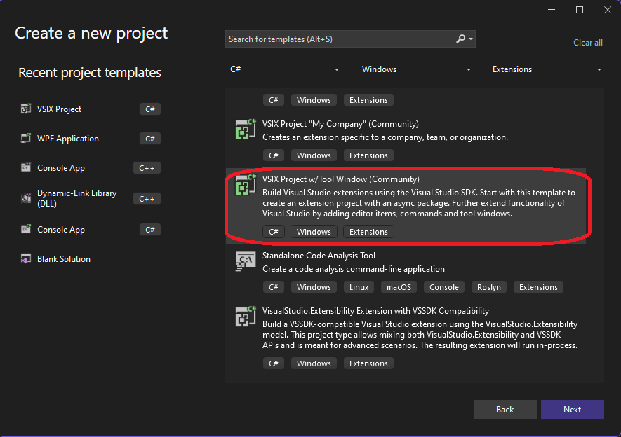

# Dependency Injection(DI) using Autofac

## Todo WIP

## Objective
1. This example introduces Dependency Injection configuration for VSix package project.
2. We are using Autofac as the container.
3. This also uses CommunityToolKit for Mvvm.

## How this project is built.
1. Starts from earlier example AutofacDllIntro project.

2. Add the following nuget packages.

3. https://www.nuget.org/packages/Community.VisualStudio.Toolkit.17
   1. Install-Package Community.VisualStudio.Toolkit.17

4. https://www.nuget.org/packages/Community.VisualStudio.VSCT
   1. Install-Package Community.VisualStudio.VSCT

5. https://www.nuget.org/packages/CommunityToolkit.Mvvm/8.4.0-preview2
   1. Install-Package CommunityToolkit.Mvvm -Version 8.4.0-preview2

6. https://www.nuget.org/packages/Microsoft.VisualStudio.Interop
   1. Install-Package Microsoft.VisualStudio.Interop -Version 17.12.40391

7. https://www.nuget.org/packages/Microsoft.VisualStudio.Shell.Interop
   1. Install-Package Microsoft.VisualStudio.Shell.Interop -Version 17.12.40391

8. https://www.nuget.org/packages/Ardalis.SmartEnum
   1. Install-Package Ardalis.SmartEnum -Version 8.2.0

9. Ensure the View Model class is derived from `ObservableObject`

10. Change the project framework to 4.8 as follows.



11. The package class must be derived from `Community.VisualStudio.Toolkit.ToolkitPackage`. So the full heirarchy would be 
Package -> AsyncPackage -> ToolkitPackage -> AutofacEnabledAsyncPackage -> AutofacComnityToolKitGetProcPackage

12. Ensure an Icon art in solution explorer as follows.



13. Ensure source.extension.vsixmanifest metatdata is as follows.



14. Add a VSix class as follows to `source.extension.cs`

```cs
internal sealed partial class Vsix
{
	public const string Id = "AutofacComnityToolKitGetProc.af97f869-18bc-4edd-b8ce-7d143b254469";
	public const string Name = "AutofacComnityToolKitGetProc";
	public const string Description = @"Empty VSIX Project.";
	public const string Language = "en-US";
	public const string Version = "1.0";
	public const string Author = "Vivek Koppula";
	public const string Tags = "";
}
```

15. The Id above should come from Manifest as follows.



16. Starting Again



17. Add the following packages.
    1. https://www.nuget.org/packages/CommunityToolkit.Mvvm/8.4.0-preview2
       1. Install-Package CommunityToolkit.Mvvm -Version 8.4.0-preview2
    2. https://www.nuget.org/packages/Ardalis.SmartEnum
       1. Install-Package Ardalis.SmartEnum -Version 8.2.0

<!-- 6. https://www.nuget.org/packages/Microsoft.VisualStudio.Interop
   1. Install-Package Microsoft.VisualStudio.Interop -Version 17.12.40391

7. https://www.nuget.org/packages/Microsoft.VisualStudio.Shell.Interop
   1. Install-Package Microsoft.VisualStudio.Shell.Interop -Version 17.12.40391 -->


## Notes
1. BusinessServicesModule is the autofac module. We configure services here.
2. We need to derive a class AutofacEnabledAsyncPackage from the Async package. This means, our package class should inherit this AutofacEnabledAsyncPackage, rather than directly AsyncPackage.  
3. This holds the autofac container
4. The command class, here the TrialToolWindowCommand class is not instanciated by the DI infrastructure.
5. But the tool window class, here TrialToolWindow is instanciated by the package by calling GetService method. 
6. This example is still not fully Mvvm, because it does not impliment INotifyPropertyChanged etc.
7. This only demonistrates DI.

## References
1. https://dotnetfalcon.com/dependency-injection-for-visual-studio-extensions/
2. https://github.com/conwid/GistManager/tree/master/GistManager


