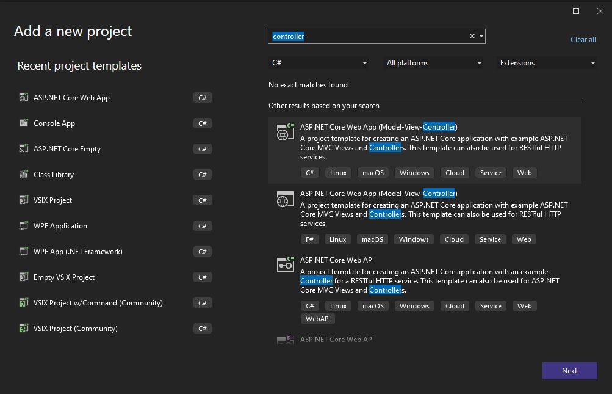
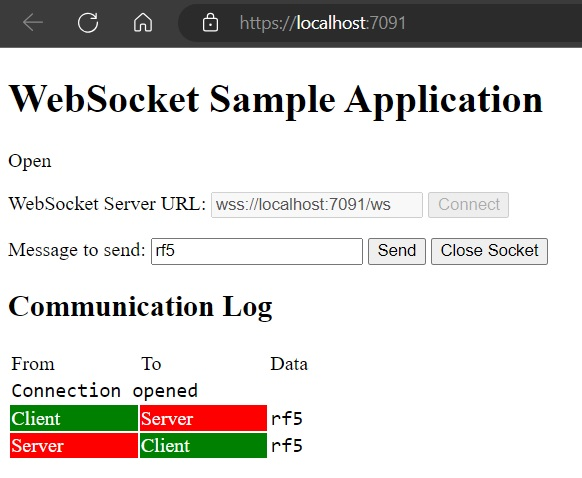

# References
1. https://github.com/dotnet/AspNetCore.Docs/tree/main/aspnetcore/fundamentals/websockets/samples/7.x/WebSocketsSample

# How this example is created.
1. First add a Asp.Net Core MVC App.



2. Ensure the index view is as current page is.
3. Add the following css

```css
table {
    border: 0
}

.commslog-data {
    font-family: Consolas, Courier New, Courier, monospace;
}

.commslog-server {
    background-color: red;
    color: white
}

.commslog-client {
    background-color: green;
    color: white
}
```
4. Then strip most other files.

# How to run. 
1. Run the app in edge or chrome. Click connect.
2. Here is the page.


