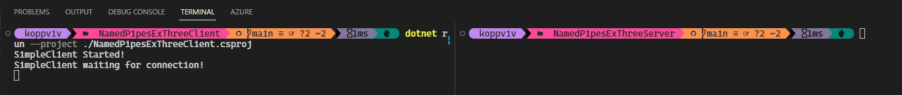

## Understanding Anonymous Pipes

# References
1. https://github.com/jawadhasan/namedpipesdemo
2. https://hexquote.com/communication-using-named-pipes-net/

# To run the example. 
1. First start the client.

2. Then start the server. 

3. So here the clints starts and waits for the server to connect to it. 

# Notes

1. Demos the write if connected scenerio. 

2. 