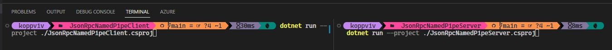
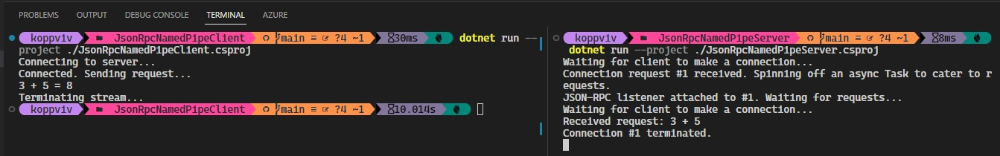

## Understanding JsonRpc and StreamRpc

# References
1. https://github.com/microsoft/vs-streamjsonrpc/blob/main/doc/overview.md
2. https://learn.microsoft.com/en-us/dotnet/api/streamjsonrpc
3. https://github.com/AArnott/StreamJsonRpc.Sample
4. https://www.tpeczek.com/2020/06/json-rpc-in-aspnet-core-with.html
5. https://www.jsonrpc.org/specification

# What is JsonRpc
1. Look at [this overview](https://github.com/microsoft/vs-streamjsonrpc/blob/main/doc/overview.md#protocol-overview). JSON-RPC is a two-party, peer-to-peer based protocol by which one party can request a method's invocation of the other party, and optionally receive a response from the server with the result of that invocation.
2. [StreamJsonRpc](https://github.com/microsoft/vs-streamjsonrpc/blob/main/doc/overview.md#streamjsonrpcs-role) is a .NET library that implements the JSON-RPC protocol and exposes it via a .NET API to easily send and receive RPC requests. StreamJsonRpc works on any transport (e.g. Stream, WebSocket, Pipe).

# This example.
1. This example is adopted from [here](https://github.com/AArnott/StreamJsonRpc.Sample).
2. To run this example, you need two terminals.

3. First run the client

4. 