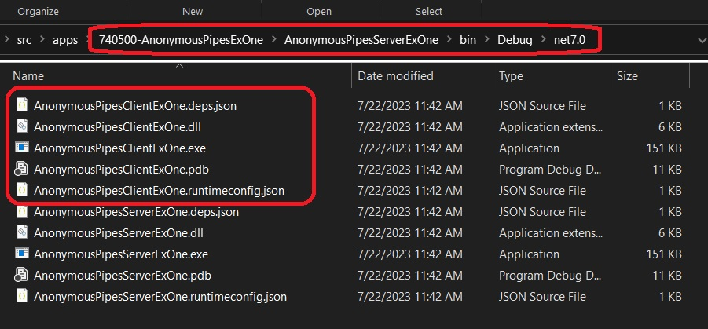
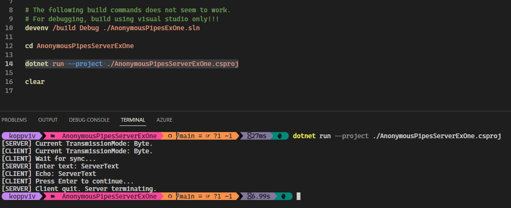

## Understanding Anonymous Pipes

# References
1. https://learn.microsoft.com/en-us/dotnet/standard/io/how-to-use-anonymous-pipes-for-local-interprocess-communication
2. https://learn.microsoft.com/en-us/windows/win32/ipc/anonymous-pipes
3. https://learn.microsoft.com/en-us/windows/win32/ipc/pipes

4. Pipes provide a way for interprocess communication. See [this](https://learn.microsoft.com/en-us/windows/win32/ipc/interprocess-communications). 
5. Anonymous pipes provide interprocess communication on a local computer. 

6. Understanding Pipes.
   1. Pipes - a communication channel between two processes.
   2. Streams - a data collection that moves from a source to a destination.
   3. Just think of the actual ‘pipe’ where water flows. The actual pipe is the infrastructure to hold the water stream. The stream is what moves the water from point A to point B via gravity and force.

7. We need to copy the client output to the server output directory. So do the following.

8. Add a target to the AnonymousPipesClientExOne.csproj as follows. The following copies all the files in the output directory. See this [Ms build docs](https://learn.microsoft.com/en-us/visualstudio/msbuild/copy-task#example-2)

```xml
<Target Name="CopyDLLs" AfterTargets="Build">
	<Message Text="Executing CopyDLLs task $(TargetDir)" Importance="High" />
    <ItemGroup>
		<MySourceFiles Include="$(TargetDir)**\*.*"/>
    </ItemGroup>
	<Copy
		SourceFiles="@(MySourceFiles)"
		DestinationFolder="..\AnonymousPipesServerExOne\$(OutDir)" />
	<Message Text="Copied build files" Importance="High" />
</Target>
```

6. The following copies specific files. We need to mention all of the files one by one that need to be copied. 

```xml
<Target Name="CopyDLLs" AfterTargets="Build">
	<Message Text="Executing CopyDLLs task $(TargetDir)" Importance="High" />
	<Copy
		SourceFiles="$(TargetDir)$(ProjectName).exe;$(TargetDir)$(ProjectName).pdb;$(TargetDir)$(ProjectName).dll;$(TargetDir)$(ProjectName).deps.json;$(TargetDir)$(ProjectName).runtimeconfig.json"
		DestinationFolder="..\AnonymousPipesServerExOne\$(OutDir)" />
	<Message Text="Copied build files" Importance="High" />	
</Target>
```

7. Ensure the files are copied correctly as follows.


8. The final output is as following.
9. 