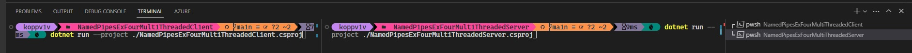

## Understanding Anonymous Pipes

# References
1. https://github.com/jawadhasan/namedpipesdemo
2. https://hexquote.com/communication-using-named-pipes-net/
3. https://learn.microsoft.com/en-us/dotnet/standard/io/how-to-use-named-pipes-for-network-interprocess-communication

# To run the example.
1. In Vs code, open two terminals as shown below. 

2. Then run in any way, first server and client or otherwise.
