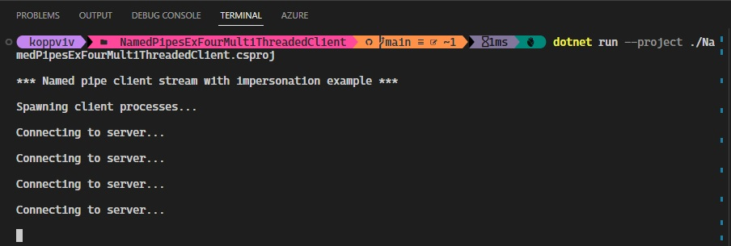
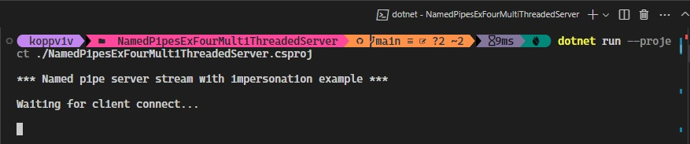
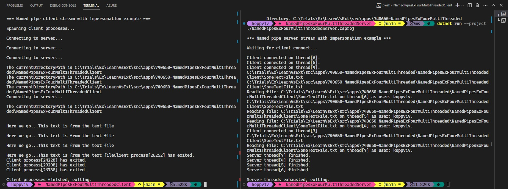

## Understanding Anonymous Pipes

# References
1. https://github.com/jawadhasan/namedpipesdemo
2. https://hexquote.com/communication-using-named-pipes-net/
3. https://learn.microsoft.com/en-us/dotnet/standard/io/how-to-use-named-pipes-for-network-interprocess-communication

# To run the example.
1. In Vs code, open two terminals as shown below. 

2. Change diretories into client and server as shown below. 

3. Then run the proj files in any way, first server and then the client or otherwise.

4. If the server is started first, it will wait for client. If the client is started first, 

5. Server Alone.

6. Running both.

# For Notes take a look at the following.
1. https://learn.microsoft.com/en-us/dotnet/standard/io/how-to-use-named-pipes-for-network-interprocess-communication#example-1

2. https://learn.microsoft.com/en-us/dotnet/standard/io/how-to-use-named-pipes-for-network-interprocess-communication#example-2

3. https://learn.microsoft.com/en-us/dotnet/standard/io/how-to-use-named-pipes-for-network-interprocess-communication#robust-programming

4. 