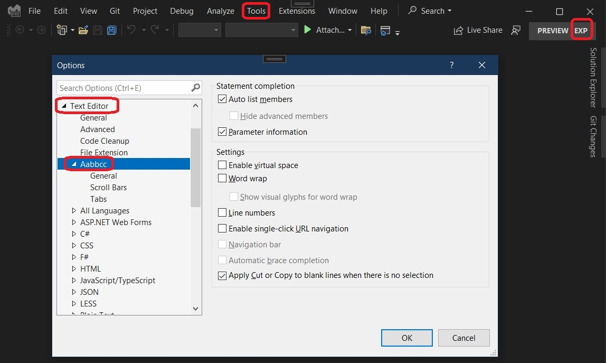

## Introduction

1. [ProvideLanguageServiceAttribute](https://learn.microsoft.com/en-us/dotnet/api/microsoft.visualstudio.shell.providelanguageserviceattribute) is introduced.


## References

1. [ProvideLanguageEditorOptionPageAttribute](https://learn.microsoft.com/en-us/dotnet/api/microsoft.visualstudio.shell.providelanguageeditoroptionpageattribute)

2. [LanguageService](https://learn.microsoft.com/en-us/dotnet/api/microsoft.visualstudio.package.languageservice) is also introduced

## How this project is built.
1. This is a regular VSix project.
2. Then add the following attribute to the package class.
```cs
[ProvideLanguageService(typeof(LanguageService), "Aabbcc", 0, ShowHotURLs = false, 
    DefaultToNonHotURLs = true, EnableLineNumbers = true, EnableAsyncCompletion = true, 
    EnableCommenting = true, ShowCompletion = true, AutoOutlining = true, CodeSense = true)]
```
3. 

## How to Run
1. Run(F5), then Exp instance launches up.
2. The result of the attribute is as below. Tools -> Options



3. Here we go.