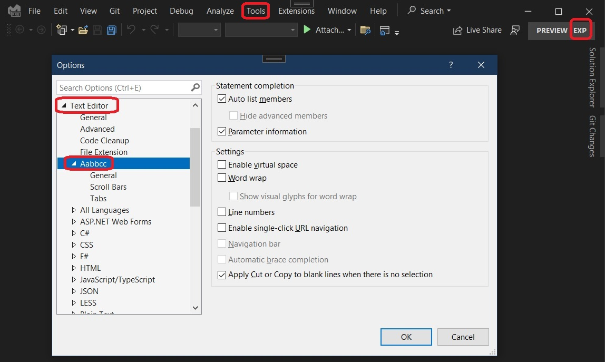

## Introduction

1. [ProvideLanguageServiceAttribute](https://learn.microsoft.com/en-us/dotnet/api/microsoft.visualstudio.shell.providelanguageserviceattribute) is introduced.
2. In the ealier example, LanguageService is introduced. In here, LanguagePreferences is introduced.
3. This is currently work in progress. Some how the debugging is not happening correctly. So the LanguagePreferences added are not working correctly. I raised the following issue https://github.com/microsoft/VSExtensibility/issues/272

## References

1. [ProvideLanguageEditorOptionPageAttribute](https://learn.microsoft.com/en-us/dotnet/api/microsoft.visualstudio.shell.providelanguageeditoroptionpageattribute)

2. [ProvideOptionPageAttribute](https://learn.microsoft.com/en-us/dotnet/api/microsoft.visualstudio.shell.provideoptionpageattribute)

## How this example is built.
1. This is a regular VSix project. 
2. The we add a CustomLanguageService which derives from LanguageService
3. Then we attempt to add language preferences by implimenting the following method.
```cs
public override LanguagePreferences GetLanguagePreferences()
{
    var languagePreferences = new LanguagePreferences(base.Site, _languageServiceId, Name);
    languagePreferences.WordWrap = true;
    languagePreferences.Init();
    return languagePreferences;
}
```
1. The CustomLanguageServie also impliments IVsEditorFactory. This should not be done here. It should be done seperately. This is work in progress.
 
2. 

## Run

2. Run(F5), then Exp instance launches up.

3. Tools -> Options

4. Without language preferences object, that is with default language preferences, Tools -> Options would look as follows.




4. Here we go.

