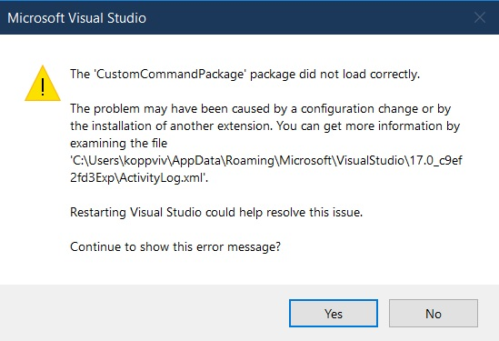

## Understanding IClassificationTypeRegistryService 

# References
1. https://learn.microsoft.com/en-us/dotnet/api/microsoft.visualstudio.text.classification.iclassificationtyperegistryservice
2. https://developercommunity.visualstudio.com/t/vsix-project-with-sdk-style-csproj/1572145

# Notes
1. Tried adding IClassificationTypeRegistryService to an SDK style VSix project. Its just not workring. Not sure why.

2. When we added the following, I get an exception.
```xml 
<PackageReference Include="Microsoft.VisualStudio.Text.Logic" Version="17.6.268" />
```



3. Unless we add the above nuget package, we will not be able to import IClassificationTypeRegistryService.

4. In essence, importing IClassificationTypeRegistryService is not happening, no matter what I do. 

5. 