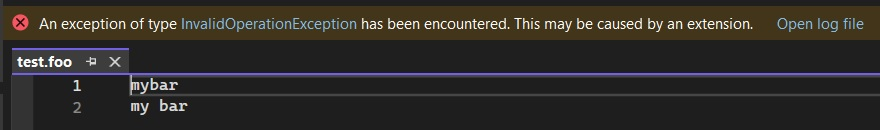

## Demos the significance of ContentType attribute

1. What is Content Type?
   1. https://learn.microsoft.com/en-us/visualstudio/extensibility/language-service-and-editor-extension-points#extend-content-types
   2.  

2. Take note that ContentType attribute is needed in the class.

```cs
[ContentType("foo")] // If we comment out this line, this class will not be instanciated. 
// The following break point in the ctor (Debugger.Break();) will not be hit if this is commented out.
[Export(typeof(ILanguageClient))]
[RunOnContext(RunningContext.RunOnHost)]
public class FooLanguageClient : ILanguageClient, ILanguageClientCustomMessage2
{
    public FooLanguageClient()
    {
        Debugger.Break();
        Instance = this;
    }
}
```

3. You may get exception as follows. You can ignore for now.



The exception is because of the following code. ILanguageClient is not fully implimented as it should be and so this exception. 
```cs
public Task<InitializationFailureContext> OnServerInitializeFailedAsync(ILanguageClientInitializationInfo initializationState)
{
    Debugger.Break();
    ...
    return Task.FromResult(failureContext);
}
```
