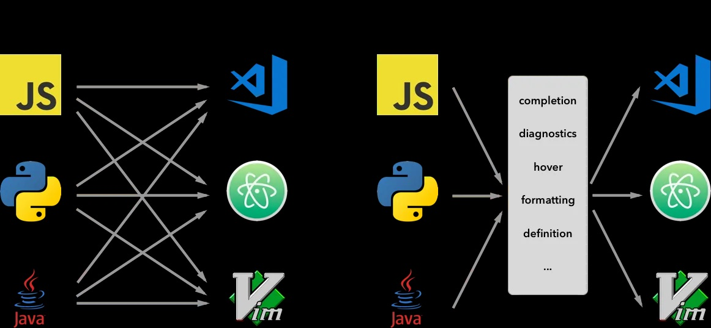

## Language Server Protocol

## To Do. This has no app to look into currently.

1. Its a strandardized way an editor(ex vs code) talks to a language server. 

2. LSP is specification of the communication between a client (editor) and a server that provides language tooling capabilities such as autocomplete, tooltips, etc. For example, instead of creating a Python VSCode plugin, a Python vim plugin, a Python Atom plugin, and Python plugins for any other potential clients, it allows developers to focus on single implementation of language server, this will be automatically supported by all clients that implement LSP.

3. The editor has to impliment the protocol. Then the editor can talk to the server using the protocol. 

4. OmniSharp is the language server for C#.

5. This started with VSCode developement, and others jumped on board. So this is spearheaded by Ms. 
6. https://microsoft.github.io/language-server-protocol/
7. [Server and client negotiage capabilites](https://youtu.be/Cw9qCsetpLU?t=439).
8. Under the covers, the communication happens via Json RPC.
9. [Bi-directional communication](https://youtu.be/Cw9qCsetpLU?t=477)
10. Transports
    1.  Stdio(aka poor mans socket, its everwhere)
    2.  WebSocket
    3.  Socket
11. The [language server typically supports features like the following](https://youtu.be/Cw9qCsetpLU?t=635). 
    1.  Goto Def
    2.  Rename a symbol
    3.  Workspace Symbol
    4.  Logging
    5.  Diagnostics/Error
    6.  Intellisence
    7.  Signature Help
    8.  Hover
    9.  Document Symbols
    10. Formatting
    11. Code Lense
    12. Code Actions
    13. 

12. https://github.com/david-driscoll/codefest-2018/blob/master/crazy-configuration/README.md
13. https://github.com/david-driscoll/dotnet-conf-2020
14. 