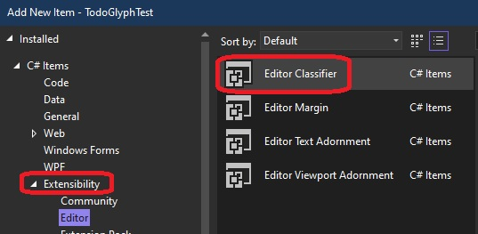
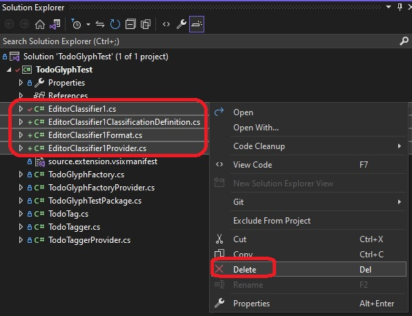
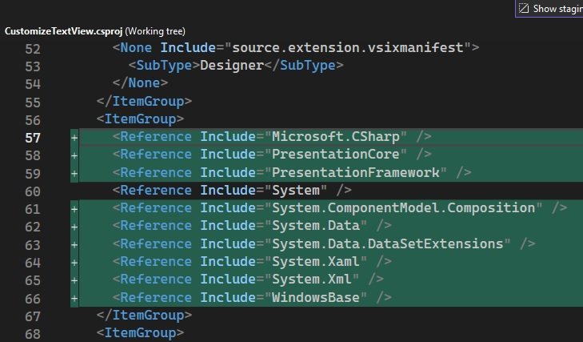

## Link a content type to a file name extension

## Reference: 
1. https://learn.microsoft.com/en-us/visualstudio/extensibility/walkthrough-linking-a-content-type-to-a-file-name-extension

2. https://learn.microsoft.com/en-us/visualstudio/extensibility/walkthrough-creating-a-margin-glyph

3. https://learn.microsoft.com/en-us/visualstudio/extensibility/vsix-manifest-designer

## Steps:
1. Follow the above link. 

2. After creating the VSix project, Add Editor classifier project.



3. Select and Delete the the Editor classifier files that get added. 



4. The reason we are adding and then deleting Editor Classifier files is the following. This adds some references to the csproj file and Assets to the .vsmanifest file. So what are assets? Take a look at [this reference here](https://learn.microsoft.com/en-us/visualstudio/extensibility/vsix-manifest-designer#uielement-list).



And the following to the .vsixmanifest file.


4. Follow the subsequent steps in the reference.

5. Build and Test.
   1. Build the solution.

   2. Run the project by pressing F5. A second instance of Visual Studio starts.
   
   3. Make sure that the indicator margin is showing. (On the Tools menu, click Options. On the Text Editor page, make sure that Indicator margin is selected.)

   4. Open a code file that has comments. Add the word "todo" to one of the comment sections. You can try a c sharp or vb.net. Make file such as SampleCShart.cs and SampleVbDotNet.vb and put code in them as follows.
   ```vb
   ' Here we go...
   ' todo
   Class Box
      Public length As Double   ' Length of a box
      Public breadth As Double  ' Breadth of a box
      Public height As Double   ' Height of a box
   End Class
   ```

   ```cs
   
   // tod todo
   // todo

   public class TempClass
   { 
   }
   ```

   5. A yellow circle with a Red outline appears in the indicator margin to the left of the code window.

6. What is a classifier?
   1. https://learn.microsoft.com/en-us/visualstudio/extensibility/language-service-and-editor-extension-points#extend-classification-types-and-classification-formats
7. So what is a Tagger? 
8. A Tagger needs a classifier