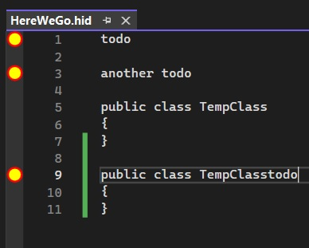

## Link a content type to a file name extension

## Reference: 
1. https://learn.microsoft.com/en-us/visualstudio/extensibility/walkthrough-linking-a-content-type-to-a-file-name-extension

2. https://learn.microsoft.com/en-us/visualstudio/extensibility/walkthrough-creating-a-margin-glyph

# How this example is created. 
1. This is started from 748525-TodoGlyphTestSdkStyle.
2. Then add this class FileAndContentTypeDefinitions.
3. Ensure the attribute ContentType("hid") is added to TodoGlyphFactoryProvider and TodoTaggerProvider.
4. The parameter should be "hid".

# How to run.
1. Run as before, 748525-TodoGlyphTestSdkStyle.
2. In the experimental instance of Visual Studio, open any file with .hid extension. A sample file is included along with the project in TestFiles folder. 
3. Once you open this file, you will see a glyph where ever there is "todo" in the file. 
4. Note this does not search for just comments. It will search for "todo" any where, and where it finds, it will create a margin glyph. 
5. In a CSharp file, a comment is a line whihc starts with //.
6. In a Vb.Net file, a comment starts with #.
7. A .hid file is custom extension. We do not know what defines a comment. We have not defined it.
8. How to define a comment in a custom extension, I dont know yet, need to find out.
9. So we are simply creating a margin glyph where ever a todo is present in the text file.

## Notes
1. Need to understand the difference between 800400-TodoClassification and 748540-TodoGlyphSdkContentTypeExt
