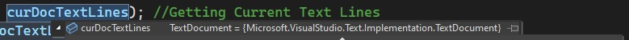
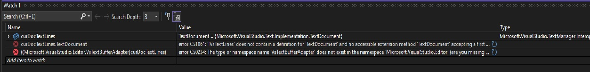
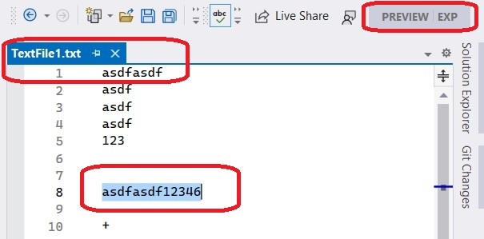
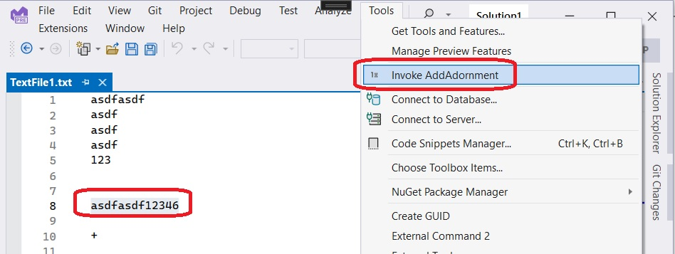
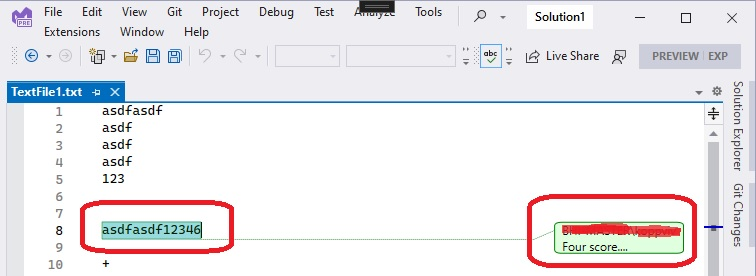

https://learn.microsoft.com/en-us/visualstudio/extensibility/walkthrough-creating-a-view-adornment-commands-and-settings-column-guides

# Build and Run.

1. Reset Visual Studio Exp instance.

2. Build the project and start debugging. The experimental instance of Visual Studio appears.

3. Open a simple and small .cs file, select some text 

4. Invoke the command.

5. An Adorment is added.

