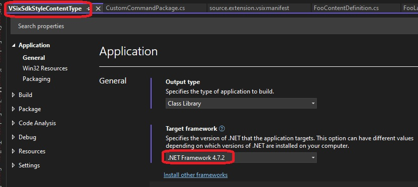
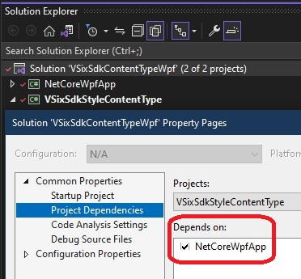

# Objective
1. Create a Sdk Style VSix project.
2. Add content type def for foo(.foo)
3. Activate a wpf application when a file with extensioin .foo(example text.foo) is opened.
4. This can be considered a tone down version of [this example](https://github.com/Microsoft/VSSDK-Extensibility-Samples/tree/master/LanguageServerProtocol). 

# References
1. https://stackoverflow.com/q/51180046/1977871
2. https://stackoverflow.com/a/51204218/1977871
3. https://github.com/Microsoft/VSSDK-Extensibility-Samples/tree/master/LanguageServerProtocol
4. https://github.com/microsoft/VSSDK-Extensibility-Samples/blob/master/LanguageServerProtocol/MockLanguageExtension/MockLanguageExtension.csproj
5. https://www.nuget.org/packages/Microsoft.VSSDK.BuildTools/
6. https://www.nuget.org/packages/Microsoft.VisualStudio.LanguageServer.Protocol/
7. https://www.nuget.org/packages/Microsoft.VisualStudio.LanguageServer.Client/
8. https://www.nuget.org/packages/Microsoft.VisualStudio.Shell.15.0/
9. 

# How the project is created.
1. Start from 400510-VSixSdkProjectIntro
2. Update the nuget packages.
3. Add the FooContentDefinition
4. Add the FooLanguageClient which impliments ILanguageClient and ILanguageClientCustomMessage2
5. Note that the Wpf application we will be using in this example is a .net core 7 one and **NOT** a dotnet framework project. 

```xml
  <PropertyGroup>
    <OutputType>WinExe</OutputType>
    <TargetFramework>net7.0-windows</TargetFramework>
    <Nullable>enable</Nullable>
    <UseWPF>true</UseWPF>
  </PropertyGroup>
```
6. Also note that the VSix project is Sdk style. And as of today VSix, any style be it old or sdk, is always a .net framework project, and this cannot be a .net core one.


7. Now a .net core project cannot be referenced by a .net framework project. So you will not be able to add a reference of the Wpf project to the VSix project. 
8. Now when we create the VSix Extension package, the package must include the wpf application as well, the exes and dlls etc. Only then the extension will be able to launch the wpf app. So how to include the wpf app into the vsix package? One way is to add a reference, but this is not possible. So we need to copy at the build time.

9. Add the following to the wpf proj file. This will ensure the output of the wpf project is copied to a folder(VSixSdkStyleContentType\WpfUiDlls), after its built.
```xml
<Target Name="CopyDLLsToWpfUiDlls" AfterTargets="Build">
	<Message Text="Executing CopyDLLs task $(TargetDir)" Importance="High" />
	<ItemGroup>
		<MySourceFiles Include="$(OutDir)\*.*"/>
	</ItemGroup>
	<Copy
		SourceFiles="@(MySourceFiles)"
		DestinationFolder="..\VSixSdkStyleContentType\WpfUiDlls" />
	<Message Text="Copied build files" Importance="High" />
</Target>
```
10. Now add the following to VSix proj file. This will ensure all the wpf output files copied into WpfUiDlls folder will be part of the final package. 
```xml
<ItemGroup>
	<Content Include="WpfUiDlls\*.*">
		<IncludeInVSIX>true</IncludeInVSIX>
	</Content>
</ItemGroup>
```
11. One final thing we need to ensure this the order in which the projects are built by Visual Studio. Open the solution properties. So in the solution explorer, right click, and select properties.


12. Now clean up everthing, build the solution and run it. Open a file with .foo extension. The wpf app should now run. 

13. Note that the nuget packages are a bit old. Updating them to the latest is not working properly. So for now keep them as they are. 

14. Note that a non null connection must be returned as follows from the **ActivateAsync(CancellationToken token)** method.

```cs
if (process.Start())
{
	await readerPipe.WaitForConnectionAsync(token);
	await writerPipe.WaitForConnectionAsync(token);

	return new Connection(readerPipe, writerPipe);
}
```

Without it, we will get exception as follows. 


The exception is because of the following code. ILanguageClient is not fully implimented as it should be and so this exception. 
```cs
public Task<InitializationFailureContext> OnServerInitializeFailedAsync(ILanguageClientInitializationInfo initializationState)
{
    Debugger.Break();
    ...
    return Task.FromResult(failureContext);
}
```

