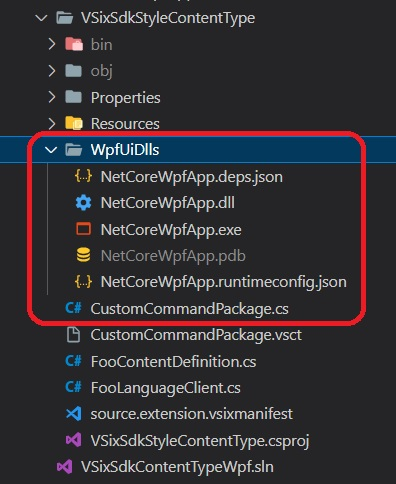
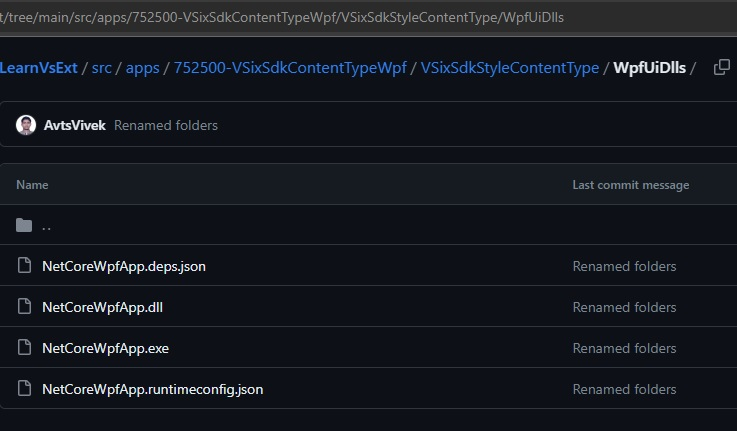
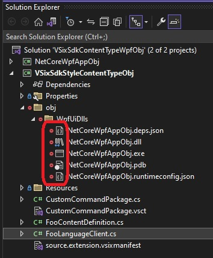

# Small Improvement 
1. Starts from 752500-VSixSdkContentTypeWpf
2. The problem with the above example is the dlls are checked into the source control system. Dlls are not supposed to be checked into github.

3. In the git hub, they look like the following. [See here](https://github.com/AvtsVivek/LearnVsExt/tree/main/src/apps/752500-VSixSdkContentTypeWpf/VSixSdkStyleContentType/WpfUiDlls).

4. Now if we move these to the obj folder, then they will not be checked in.


# How the project is created
1. Starts from 752500-VSixSdkContentTypeWpf
2. Change the target like so.
```xml
<Target Name="CopyDLLsToWpfUiDlls" AfterTargets="Build">
	<Message Text="Executing CopyDLLs task $(TargetDir)" Importance="High" />
	<ItemGroup>
		<MySourceFiles Include="$(OutDir)\*.*"/>
	</ItemGroup>
	<Copy
		SourceFiles="@(MySourceFiles)"
		DestinationFolder="..\VSixSdkStyleContentTypeObj\obj\WpfUiDlls" />
	<Message Text="Copied build files" Importance="High" />
</Target>
```
3. Also the include of the folder.
```xml
<ItemGroup>
	<Content Include="obj\WpfUiDlls\*.*">
		<IncludeInVSIX>true</IncludeInVSIX>
	</Content>
</ItemGroup>
```
4. 