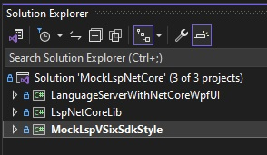
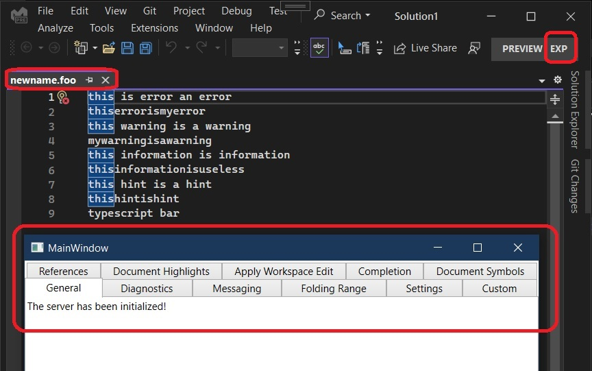

# References
1. https://github.com/Microsoft/VSSDK-Extensibility-Samples/tree/master/LanguageServerProtocol

# Notes
1. This example is created from [LanguageServerProtocol example here](https://github.com/Microsoft/VSSDK-Extensibility-Samples/tree/master/LanguageServerProtocol)

2. In there, the wpf app is a .net framework app. But this here, the app is .net core 7. 

3. Look at the Wpf Project file `LanguageServerWithNetCoreWpfUI.csproj`
```xml
<Target Name="CopyDLLsToWpfUiDlls" AfterTargets="Build">
    <Message Text="Executing CopyDLLs task $(TargetDir)" Importance="High" />
    <ItemGroup>
        <MySourceFiles Include="$(OutDir)\*.*" />
    </ItemGroup>
    <Copy SourceFiles="@(MySourceFiles)" DestinationFolder="..\MockLspVSixSdkStyle\obj\WpfUiDlls" />
    <Message Text="Copied build files" Importance="High" />
</Target>
```

This Target will copy the wpf proj dlls to the VSix output directory. Also note the following in the same csproj file.

```xml
  <ItemGroup>
    <ProjectReference Include="..\LspNetCoreLib\LspNetCoreLib.csproj" />
  </ItemGroup>
```

This will ensure `LanguageServerWithNetCoreWpfUI.csproj` project references LspNetCoreLib

4. MockLspVSixSdkStyle is a VSix project, but SDK style project.

## How to run. 
1. See [Run the sample section under this](https://github.com/Microsoft/VSSDK-Extensibility-Samples/tree/master/LanguageServerProtocol#language-server-protocol-sample)



2. Run the VSix project. Exp instance will start. 

3. Then open the files test.foo or newname.foo 



4. 


