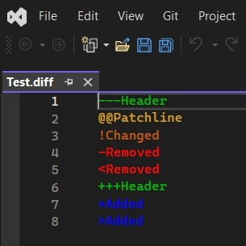

# Diff Classifier Sample

## Reference: 

1. https://github.com/microsoft/VSSDK-Extensibility-Samples/tree/master/Diff_Classifier

## How this project is created. 

1. Create a VSix project.

2. Added necessary references, such as presentation core etc.

3. Add an asset node of type MefComponent in the vsixmanifest, etc

4. The above two steps can be accomplished by adding a EditorClassifier new item and then deleting it.
5. Next add the remaining files.

## How to run

1. Build and run. In the exp instance, open a code file with has todo text in it. 

## Notes

1. 

